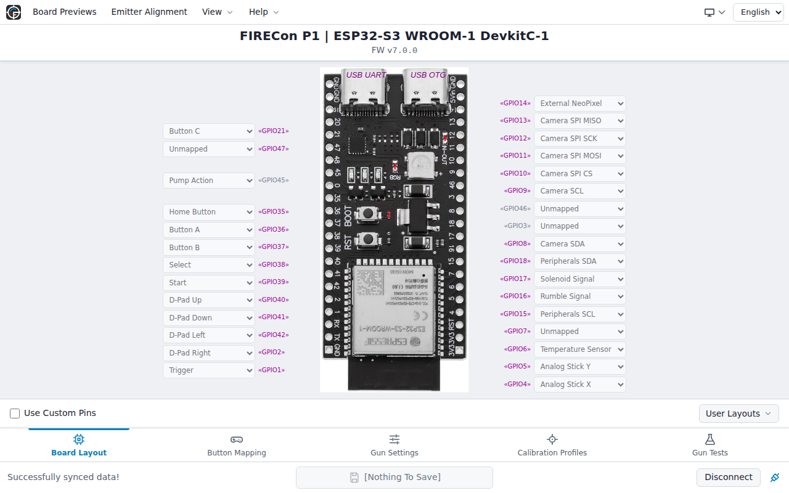
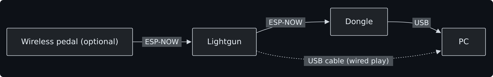
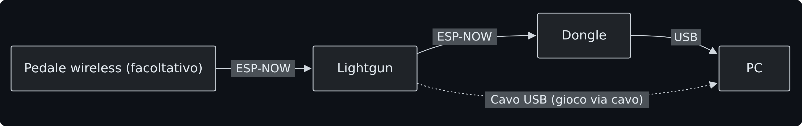

  <a href="#english-version"> English Version</a> &nbsp;•&nbsp; <a href="#versione-italiana"> Versione Italiana</a>

# OpenFIRE Firmware for ESP32

      

  

  <b>DOCUMENTATION:</b> 
  <a href="#getting-started">Getting Started</a> &nbsp; | &nbsp; <a href="lightgun/README.md#english-version">Lightgun Module</a> &nbsp; | &nbsp; <a href="dongle/README.md#english-version">Dongle Receiver</a> &nbsp; | &nbsp; <a href="pedal/README.md#english-version">Wireless Pedal</a>

   
   
  <a href="https://alessandro-satanassi.github.io/OpenFIRE-ESP32-Tools/?lang=en">Tools and downloads</a>

 

  <b>WATCH THE VIDEO SHOWCASE & GAMEPLAY:</b>  
  
  &nbsp;&nbsp;&nbsp;
  
  &nbsp;&nbsp;&nbsp;
  

---
> **Hardware sponsored by [PCBWay](https://www.pcbway.com)**
---

## At a Glance

OpenFIRE ESP32 turns an ESP32-S3 board into a complete lightgun for modern TVs and monitors, to play with a cable or without.

- **Accurate aiming:** four IR emitters around the screen and a camera in the gun, with tracking refined for the Square layout, even close to the screen and near its edges.
- **Wireless play:** a small USB dongle receives the data from the gun. The computer sees standard mouse, keyboard and gamepad devices, updated 209 times per second exactly as with the USB cable, with no drivers to install. Up to four guns can play together, each with its own dongle.
- **Nothing to install:** the firmware is installed from the browser with the [Web Flasher](https://alessandro-satanassi.github.io/OpenFIRE-ESP32-WebFlasher/?lang=en), and the gun is configured and tested with the [WebApp](https://alessandro-satanassi.github.io/OpenFIRE-ESP32-WebApp/?lang=en), online or, without Internet and even from a phone, through the WebApp stored in the gun.
- **Guided calibration:** the WebApp shows at every target whether the camera sees the four emitters well, and refuses the shot when one is missing, so every calibration starts from a good view.
- **One firmware, three cameras:** Wii Cam / DFRobot SEN0158, PixArt PAJ7025R2 and the wide-angle PixArt PAJ7025R3.
- **Complete feedback:** solenoid, rumble motor, NeoPixel LEDs and an OLED display for menus, life and ammo, with game-driven force feedback through MAMEHOOKER and similar programs.
- **Optional wireless pedal** for cover shooters such as the *Time Crisis* series.
- **Compatible with the original OpenFIRE firmware** in everyday use: same features, same outputs to games and same serial commands. It works with emulators such as MAME and RetroArch, with TeknoParrot and with MiSTer FPGA, and it is free and open source like the original project.

To build and set up your first gun, follow [Getting Started](#getting-started).

## Introduction - what is OpenFIRE-firmware *(The Open Four Infra-Red Emitter Light Gun System)*

About the original OpenFIRE project

*... from the [OpenFIRE](https://openfirelightgun.org/) project homepage:*
>OpenFIRE Lightgun is a feature-rich open-source firmware to allow lightgun enthusiasts to build their own lightgun that will work on modern flat screen displays. OpenFIRE uses small infrared LEDs mounted to the perimeter of your display arranged in a rectangle pattern with two on top and two on bottom (dual sensor bar) or a diamond pattern (one at the middle of each side). An infrared detecting camera mounted inside the lightgun is used to track the position of the infrared LEDs to aim your lightgun.
>The OpenFIRE firmware is software that is programmed onto a microcontroller circuit board inside your lightgun. When the trigger is pulled or a button pressed, the firmware sends the appropriate command to your emulator via USB or Bluetooth. The firmware also controls feedbacks such as a solenoid, rumble motor or RGB LEDs to enhance your gaming experience.
>The [OpenFIRE App/GUI](https://github.com/TeamOpenFIRE/OpenFIRE-App) is software that runs on your Windows or Linux computer and is used to configure and test your OpenFIRE lightgun.

## What is the OpenFIRE-firmware port for ESP32

This repository is a port of the [OpenFIRE firmware](https://github.com/TeamOpenFIRE/OpenFIRE-Firmware) by TeamOpenFIRE to the **ESP32-S3** microcontroller. It keeps the original project's features, with three main differences:

- **Wireless play through a dongle:** instead of Bluetooth, the gun talks to a small dongle plugged into the computer over **ESP-NOW**, the ESP32's own radio protocol. The gun keeps the same responsiveness and behaviour as when it is connected by cable.
- **Refined tracking for the Square layout:** less jitter, better handling of a tilted gun and more tolerance when an emitter briefly disappears from view, for a steadier pointer, accurate up to the screen edges and over a wider range of distances. *(The Diamond layout keeps the original tracking.)*
- **Configuration in the browser:** the gun is configured with the **[WebApp](https://alessandro-satanassi.github.io/OpenFIRE-ESP32-WebApp/?lang=en)** instead of the original App.

## Getting Started

New to OpenFIRE? Here is what you need and the steps to follow; each step links to the detailed instructions.

**What you need:** a lightgun built around an ESP32-S3 board, with an IR camera, four IR emitters and buttons. To play without cables you also need a [dongle](dongle/README.md#english-version) plugged into the computer and a battery in the gun; the [wireless pedal](pedal/README.md#english-version) is optional.

**How much work is it?** You can follow the complete [PICON-AS project](https://alessandro-satanassi.github.io/OpenFIRE-PICON-AS-ESP32/) (currently in Italian), with a 3D-printable shell, wiring diagrams and a rechargeable battery, or build your own gun around an ESP32-S3 development board: basic soldering and wiring skills are enough. For the dongle, a ready-made USB stick such as the LILYGO T-Dongle-S3 only needs the firmware, with no soldering ([dongle guide](dongle/README.md#english-version)).

**Two web tools, two jobs:** the Web Flasher installs or updates the firmware on each device, while the WebApp configures and tests the lightgun. Use the Web Flasher first, then the WebApp; both are also linked from the [project hub](https://alessandro-satanassi.github.io/OpenFIRE-ESP32/?lang=en).

1. **Build the lightgun:** an ESP32-S3 board, an IR camera, a trigger and, ideally, the A and B buttons ([hardware requirements](lightgun/README.md#english-version)). Components and purchase links are on the [PICON-AS site](https://alessandro-satanassi.github.io/OpenFIRE-PICON-AS-ESP32/). Note the exact [board variant](lightgun/README.md#board-variant), for example N16R8.
2. **Install the firmware** with the [Web Flasher](https://alessandro-satanassi.github.io/OpenFIRE-ESP32-WebFlasher/?lang=en) in Chrome, Edge or Opera: choose the device, the board and its variant. For a new board, or when coming from 6.2.1, choose **Clean Install**.
3. **Open the [WebApp](https://alessandro-satanassi.github.io/OpenFIRE-ESP32-WebApp/?lang=en)** and connect the lightgun with a USB data cable ([how to connect](lightgun/src/README.md#configuration-with-the-webapp)).
4. **Set pins and camera:** assign the buttons and the camera pins in **Board Layout**, select your camera in **Gun Settings → CAMERA Model** (after a clean installation it is DFRobot/Wii) and, if fitted, enable the OLED display; then save ([details](lightgun/src/README.md#camera-display-and-startup-settings)).
5. **Mount the four IR emitters** around the screen ([IR emitter setup](lightgun/src/README.md#ir-emitter-setup)).
6. **Calibrate** each profile you use, then save ([how to calibrate](lightgun/src/README.md#how-to-calibrate)).
7. **Test** the buttons in **Gun Tests** and the camera with **Open IR Camera Tester...** ([test mode](lightgun/src/README.md#test-mode)).
8. **Play** with the USB cable, or wirelessly: plug in the [dongle](dongle/README.md#english-version) and wait about 15 seconds, switch on the [wireless pedal](pedal/README.md#english-version) if you use one, then switch on the gun. [Your First Game](lightgun/src/README.md#your-first-game) explains how to leave configuration and set up the game's inputs. For two to four players, see [several guns](lightgun/src/README.md#multiple-guns-and-multiplayer).

If something does not work, see [Common Problems](lightgun/src/README.md#common-problems). The [operational manual](lightgun/src/README.md#english-version) explains buttons, pause mode and profiles.

## What's New in 7.0.0

Version 7.0.0 introduces the **[OpenFIRE ESP32 WebApp](https://alessandro-satanassi.github.io/OpenFIRE-ESP32-WebApp/?lang=en)** as the main configuration tool: map pins and buttons, choose your camera, calibrate profiles and test the lightgun without installing anything.

  

* **Three camera models in one firmware:** DFRobot SEN0158 / Wii Cam, PixArt PAJ7025R2 and the wide-angle PAJ7025R3. Select yours in the WebApp: no separate firmware per camera. The firmware also corrects the distortion of the R3's wide-angle lens.
* **Online or offline configuration:** use the online WebApp through the USB cable or the paired dongle, or hold **B while switching on for about 2 seconds** to start the WebApp stored in the lightgun, reachable over Wi-Fi or USB networking, phones included.
* **Firmware update without opening the gun:** on a lightgun already running 7.0.0, hold **Trigger + A while switching on for about 2 seconds**, then connect its USB OTG port to the computer and use the Web Flasher.
* **One firmware file per board:** normal updates and clean installations use the same file; a clean installation erases all settings and calibrations.
* **Square layout with LEDs at the screen corners:** besides the recommended vertical rectangle, a wider rectangle with the LEDs at the screen corners is now supported. Calibrate again after changing the emitter layout.
* **Clearer IR camera test:** each emitter circle shows the size and brightness of the light spot seen by the camera, emitters that are not seen are marked with a red X, and a legend explains every symbol. LED placement and camera sensitivity are much easier to check.
* **Calibration that checks the emitters:** in the WebApp and the desktop App the crosshair is green when the camera sees all four emitters well, orange when one is weak and red when one is missing; a panel shows each emitter, and target shots are refused while an emitter is not seen. Progress dots mark the targets, and a brief white flash on the crosshair confirms each accepted shot.
* **Easier calibration from the gun:** the cursor traces a small circle on each target, and an OLED display shows where the target is and how far along you are.
* **Output mode from the pause menu:** switch between absolute mouse and gamepad (aim on the right or the left stick) while you play, without serial commands: **Output Mode** in the Simple Pause Menu, or Select + Up / Select + Down in Hotkey pause mode. The change lasts until the gun is switched off; the startup mode is set in the WebApp.

For migration from 6.2.1, a **clean installation is recommended**. Note your current settings first, then configure the camera and pins and calibrate again. Use lightgun, dongle and pedal firmware from the same release. Configuration Apps for earlier firmware do not work with the new configuration protocol.

[Open the ecosystem hub](https://alessandro-satanassi.github.io/OpenFIRE-ESP32/?lang=en) for configuration, firmware installation and downloads. The [lightgun guide](lightgun/README.md#english-version) explains the connections and boot modes. The [changelog](CHANGELOG.md) lists every change.

## Main Features and Capabilities
The firmware turns the microcontroller into a complete lightgun controller, with the features of the original project:

* **Advanced IR tracking:** four infrared points with real-time perspective correction, so aiming stays accurate even when you do not stand exactly in front of the screen. Double lightbar (Square, recommended) and Diamond layouts are supported.
* **Complete peripheral support:** recoil and vibration (solenoid and rumble motor), solenoid temperature monitoring with a TMP36 sensor, and NeoPixel WS2812B or RGB lighting.
* **Flexible inputs and mapping:** keyboard, 5-button absolute-positioning mouse and dual-stick gamepad with D-pad, all at the same time, with every button freely remappable.
* **WebApp and internal memory:** configure and test the lightgun with the online or built-in **[OpenFIRE ESP32 WebApp](https://alessandro-satanassi.github.io/OpenFIRE-ESP32-WebApp/?lang=en)**. Calibration profiles and settings are stored in the gun; save before disconnecting or switching it off.
* **OLED display:** an SSD1306 I2C display for the pause menu, the calibration guide, the connection status and the life and ammo counters.
* **Broad compatibility:** works with PC force feedback programs (such as MAMEHOOKER, The Hook Of The Reaper and QMamehook) and with MiSTer FPGA.

## Project Philosophy and Porting

Background and development of the ESP32 port

This port brings a complete open-source lightgun to a board that can also work without cables. It is built with PlatformIO and, apart from the wireless part, stays very close to the original TeamOpenFIRE code:

* **Transparent wireless:** the gun and its dongle talk directly over ESP-NOW, and the computer sees a standard USB device, with no perceptible latency and no extra drivers or software.
* **Refined tracking:** the Square layout calculations were reworked for a very steady pointer even close to the screen and with the gun tilted on its axis. *(The Diamond layout keeps the original tracking.)* When these improvements have proven themselves, I intend to offer them to the original project through a Pull Request, so the whole OpenFIRE community can benefit.
* **Faithful to the original:** apart from the ESP32 adaptations and the radio link, the control logic follows the official version, so improvements and fixes from TeamOpenFIRE can keep flowing into this port.

Special thanks to TeamOpenFIRE for their excellent work on the original firmware: the core architecture is theirs, and so is our gratitude for making such an advanced system available to everyone.

## Supported Microcontrollers
The project is built and tested for the **ESP32-S3**, which supports every feature, including the ESP-NOW wireless link and the USB OTG port that presents the gun to the computer *(for example ESP32-S3-WROOM1-DevKitC-1, Waveshare ESP32-S3-PICO, Waveshare ESP32-S3-ZERO, LILYGO T-Dongle-S3, ESP32-S3 Pocket Dongle S3)*.

For the easiest build, these boards are recommended:

| Device | Recommended Boards | Usage |
| :--- | :---: | :--- |
| **Lightgun** |   | **ESP32-S3-DevKitC-1 / Waveshare S3-PICO** Ideal inside the gun shell, with plenty of pins for all the buttons, the camera and the feedback devices. |
| **Dongle** |   | **LILYGO T-Dongle-S3 / Pocket Dongle S3** Ready-made sticks with a built-in USB connector: plug them straight into the computer, no cables or soldering. |
| **Pedal** |  | **Waveshare ESP32-S3-ZERO** Tiny, so it fits inside a pedal, where space is tight and only a few pins are needed. |

**Any standard board, any role:** apart from the USB sticks (LILYGO T-Dongle, Pocket Dongle), which are made to be plugged into the computer as receivers, a DevKitC-1, PICO or ZERO can be used for the lightgun, the pedal or even a home-made dongle with a USB cable. Each module's guide shows the wiring.

> *RP2040 boards: the code still builds for the original RP2040 boards, but only for wired USB play. Development and all the wireless features are focused on the ESP32-S3.*

## System Architecture
The project has three parts, each with its own guide:

  

For wireless play the pedal talks to the lightgun, and the lightgun to the dongle plugged into the PC. For wired play the lightgun is connected to the PC directly by USB cable.

1. ***Lightgun Firmware***
   The heart of the system: camera, buttons and feedback devices (solenoid, rumble, LEDs), wired or wireless.
   Guide: **[Lightgun Folder](lightgun/README.md#english-version)**

2. ***Receiver Dongle***
   The invisible bridge between the lightgun and the PC: it receives the gun's data over ESP-NOW and presents it to the computer as standard USB devices.
   Guide: **[Dongle Folder](dongle/README.md#english-version)**

3. ***Wireless Pedal***
   Optional, but essential for cover shooters such as Time Crisis. It talks directly to the gun with very low latency, with no cable across the floor.
   Guide: **[Pedal Folder](pedal/README.md#english-version)**

## Quick Installation (Web Flasher)

The easiest, fastest and safest way to install or update the firmware of any module (Lightgun, Dongle or Pedal) is the Web Flasher. No drivers and no programs: everything runs in your browser.

* **Requirements:** a computer with Google Chrome, Microsoft Edge or Opera.

**[LAUNCH OPENFIRE ESP32 WEB FLASHER](https://alessandro-satanassi.github.io/OpenFIRE-ESP32-WebFlasher/?lang=en)**

> **For advanced users:** if your browser does not support the Web Flasher, or you prefer the command line, each module's guide explains how to install the `.bin` files yourself.

## Connectivity Management
The gun chooses the connection by itself:

* **USB cable:** if the gun is connected to the computer by a USB data cable when you switch it on, it plays wired and switches the radio off.
* **Wireless:** without the cable, the gun looks for its dongle and pairs with it automatically; the dongle has already chosen the radio channel with the least interference. If **Wireless pedal** is enabled, the gun then looks for the pedal for 10 seconds. From then on the computer sees the gun exactly as if it were connected by cable.
* **Fast reconnection:** if you switch only the gun off and on again, it reconnects almost instantly to the dongle and pedal it was paired with, as long as they stayed on. After restarting the dongle or the pedal, restart the gun too.
* **Status at a glance:** the gun and dongle displays show icons for the connection type and status; the pedal uses its 4 LEDs.

The [lightgun guide](lightgun/README.md#english-version) describes the startup sequence step by step.

## PICON-AS Hardware Project
To build a fully wireless, battery-powered lightgun for this firmware, there is the **PICON-AS** reference project: a lightgun derived from PICON-OG, designed around a rechargeable 21700 Li-ion battery and the wireless ecosystem. It includes detailed assembly instructions, STL files for 3D printing and wiring diagrams.

Hardware manual: **[PICON-AS Documentation Site](https://alessandro-satanassi.github.io/OpenFIRE-PICON-AS-ESP32/)**

> [!NOTE]
> The site is already usable and its technical content is correct; a few instruction sections are still being written. It is currently in Italian only and will be translated into English once complete.

## Further Reading

- [Operational manual](lightgun/src/README.md#english-version): buttons, pause mode, calibration, profiles, common problems and known limitations.
- [MAMEHOOKER documentation](https://github.com/alessandro-satanassi/OpenFIRE-Firmware-ESP32/wiki/MAMEHOOKER_Documentation_EN): setting up game-driven force feedback.
- [OpenFIRE serial commands](https://github.com/alessandro-satanassi/OpenFIRE-Firmware-ESP32/wiki/Serial_Commands_OpenFIRE_EN): the commands the gun accepts from force-feedback programs.
- [Changelog](CHANGELOG.md): what changed in each release.
- [Build guide](lightgun/docs/COMPILING.md): for developers who want to build the firmware themselves.

## Community and Support

Depending on the kind of help you need, you can join two Discord communities:

* **Official OpenFIRE Server:** the main place for the firmware. For questions about the software, technical issues or news, this is the right place. **Visit the `#software-ports` channel**, dedicated to ports like this ESP32 one.
 

* **DIY Lightgun Builders:** the place for advice on building the hardware, 3D printing and soldering, or to show off your finished PICON-AS (there is a dedicated **`#Picon-AS`** channel).
 

**Useful websites:**
* [OpenFIRE ESP32 Hub](https://alessandro-satanassi.github.io/OpenFIRE-ESP32/?lang=en)
* [OpenFIRE ESP32 WebApp (configuration)](https://alessandro-satanassi.github.io/OpenFIRE-ESP32-WebApp/?lang=en)
* [OpenFIRE Firmware (Official Site)](https://openfirelightgun.org/)
* [OpenFIRE ESP32 Tools (desktop App and other downloads)](https://alessandro-satanassi.github.io/OpenFIRE-ESP32-Tools/?lang=en)
* [DIY Lightgun](https://diylightgun.com/lightguns/?pt=lightgun)
* [Picon-AS (Picon-AS lightgun website)](https://alessandro-satanassi.github.io/OpenFIRE-PICON-AS-ESP32/)

**Related GitHub repositories:**
* [OpenFIRE Firmware ESP32 (this repository)](https://github.com/alessandro-satanassi/OpenFIRE-Firmware-ESP32)
* [OpenFIRE Firmware (original, RP2040)](https://github.com/TeamOpenFIRE/OpenFIRE-Firmware)
* [OpenFIRE App (original project, not the ESP32 configuration App)](https://github.com/TeamOpenFIRE/OpenFIRE-App)
* [OpenFIRE Boards (for developers adding a new board to the project)](https://github.com/TeamOpenFIRE/OpenFIRE-Boards)

## Sponsorship & Support

A special thanks to **[PCBWay](https://www.pcbway.com)** for sponsoring the hardware development of this project. Their professional PCB manufacturing has been fundamental in turning our schematics into reliable, high-quality boards.

We chose PCBWay for their:
* **Manufacturing precision:** excellent solder mask and silkscreen quality, even on dense designs.
* **Reliability:** consistent quality across different batches.
* **Fast prototyping:** short turnaround times that sped up our testing considerably.

  

## Credits & Acknowledgments

### Original OpenFIRE Core Team & Contributors
A special thanks to the original authors and the OpenFIRE community, without whom this port and its additions (dongle and pedal) would never have existed:
* **That One Seong** (`SeongsSeongs@gmail.com`): lead developer and coordinator of the OpenFIRE project.
* **Samuel Ballantyne (Samco)** (`samuelballantyne@hotmail.com`): for his original SAMCO project, the gorgeous OpenFIRE branding and the perspective-based tracking system.
* **Mike Lynch (Prow7)**: for his enhanced SAMCO fork, the basis of pause mode and of the saving system.
* **Odwalla-J, mrkylegp, RG2020 & lemmingDev**: for prerelease consultation, bug testing and feedback.
* **The IR-GUN4ALL testers**: for their early feedback and feature requests. This wouldn't have happened without you lot!
* **Chris Young**: for his TinyUSB compatible library (now part of `TinyUSB_Devices`).

### ESP32 Port Contributors
A huge thank you to those who personally supported the development and testing of this ESP32 port:
* **Reverse Cosmos**: for his invaluable help and the time spent testing the OpenFIRE ESP32 firmware.
* **VINNY!**: for designing the mechanical parts and providing the .stl files of the wireless pedal.
* **Alextrical**: for designing the PCBs for the PixArt PAJ7025R2 and PixArt PAJ7025R3 cameras.

## License, Commercial Use, and Forks

The official firmware downloads are **free of charge**; you do not need to buy a licence to use them. Distribution and modification are governed by the [GNU LGPL licence included in the repository](https://github.com/alessandro-satanassi/OpenFIRE-Firmware-ESP32/blob/main/LICENSE). In addition, we ask those who build on this work to respect the following:

* **No rebranding:** forks made only to rebrand the project (changing names and logos to present it as one's own) are strongly **DISCOURAGED**. We ask forks to keep the OpenFIRE name and credit both the original core authors (That One Seong, Samco, Prow7) and the author of this ESP32 wireless port (Alessandro Satanassi).

* **Commercial integrations:** we ask makers of products using this firmware (for example pre-assembled lightguns for sale) to state it clearly and credit both the core authors and the port author. Anyone profiting from this volunteer work is also invited to consider a donation or sponsorship.
  * For commercial enquiries, collaborations or licensing about this **ESP32 port and the wireless ecosystem (dongle/pedal)**, contact *Alessandro Satanassi* (`alessandro@cittini.it`).
  * For commercial or licensing enquiries about the **original OpenFIRE core**, open a thread in the Discussions section of the [original repository](https://github.com/TeamOpenFIRE/OpenFIRE-Firmware) or contact *That One Seong* (`SeongsSeongs@gmail.com`) and/or *Samuel Ballantyne* (`samuelballantyne@hotmail.com`).

* **GNU LGPL compliance:** anyone redistributing the firmware, whether unchanged or modified, must comply with its licence, including the requirements concerning copyright notices and access to the corresponding source code. Refer to `LICENSE` for the full conditions.

* **Official downloads:** download the firmware from this project's Releases page or Web Flasher. Paid hardware, assembly or support services are separate from the official firmware, which is available free of charge.

---

  <a href="#english-version"> English Version</a> &nbsp;•&nbsp; <a href="#versione-italiana"> Versione Italiana</a>

# OpenFIRE Firmware per ESP32

      

  

  <b>DOCUMENTAZIONE:</b> 
  <a href="#primi-passi">Primi passi</a> &nbsp; | &nbsp; <a href="lightgun/README.md#versione-italiana">Modulo Lightgun</a> &nbsp; | &nbsp; <a href="dongle/README.md#versione-italiana">Ricevitore Dongle</a> &nbsp; | &nbsp; <a href="pedal/README.md#versione-italiana">Pedale Wireless</a>

   
   
  <a href="https://alessandro-satanassi.github.io/OpenFIRE-ESP32-Tools/?lang=it">Tools e download</a>

 

  <b>GUARDA I VIDEO SHOWCASE & GAMEPLAY:</b>  
  
  &nbsp;&nbsp;&nbsp;
  
  &nbsp;&nbsp;&nbsp;
  

---
> **Hardware sponsored by [PCBWay](https://www.pcbway.com)**
---

## In breve

OpenFIRE ESP32 trasforma una scheda ESP32-S3 in una lightgun completa per TV e monitor moderni, da usare via cavo o senza fili.

- **Mira precisa:** quattro emettitori IR intorno allo schermo e una telecamera nella pistola, con un tracciamento affinato per il layout Square, anche vicino allo schermo e ai suoi bordi.
- **Gioco senza fili:** un piccolo dongle USB riceve i dati dalla pistola. Il computer vede normali dispositivi mouse, tastiera e gamepad, aggiornati 209 volte al secondo esattamente come con il cavo USB, senza driver da installare. Fino a quattro pistole possono giocare insieme, ognuna con il proprio dongle.
- **Niente da installare:** il firmware si installa dal browser con il [Web Flasher](https://alessandro-satanassi.github.io/OpenFIRE-ESP32-WebFlasher/?lang=it) e la pistola si configura e si prova con la [WebApp](https://alessandro-satanassi.github.io/OpenFIRE-ESP32-WebApp/?lang=it), online oppure, senza Internet e anche da telefono, con la WebApp contenuta nella pistola.
- **Calibrazione guidata:** la WebApp mostra a ogni bersaglio se la telecamera vede bene i quattro emettitori e rifiuta il tiro quando ne manca uno, così ogni calibrazione parte da una buona visuale.
- **Un firmware, tre telecamere:** Wii Cam / DFRobot SEN0158, PixArt PAJ7025R2 e PixArt PAJ7025R3 grandangolare.
- **Feedback completo:** solenoide, motore rumble, LED NeoPixel e display OLED per menu, vite e munizioni, con force feedback guidato dal gioco tramite MAMEHOOKER e programmi simili.
- **Pedale wireless facoltativo** per i cover shooter come la serie *Time Crisis*.
- **Compatibile con il firmware OpenFIRE originale** nell'uso di tutti i giorni: stesse funzioni, stesse uscite verso i giochi e stessi comandi seriali. Funziona con emulatori come MAME e RetroArch, con TeknoParrot e con MiSTer FPGA, ed è libero e gratuito come il progetto originale.

Per costruire e configurare la tua prima pistola segui i [Primi passi](#primi-passi).

## Premessa - cos'è OpenFIRE-firmware *(The Open Four Infra-Red Emitter Light Gun System)*

Il progetto OpenFIRE originale

*... dalla homepage del progetto [OpenFIRE](https://openfirelightgun.org/):*
>OpenFIRE Lightgun è un firmware open source ricco di funzionalità che consente agli appassionati di costruire la propria lightgun compatibile con i moderni schermi piatti. OpenFIRE utilizza piccoli LED a infrarossi montati sul perimetro del display, disposti secondo uno schema rettangolare con due in alto e due in basso (configurazione a doppia barra sensore) oppure a diamante (uno al centro di ogni lato). Una telecamera a infrarossi montata all'interno della lightgun viene utilizzata per tracciare la posizione dei LED e consentire il puntamento.
>Il firmware OpenFIRE è il software che viene programmato sulla scheda del microcontrollore all'interno della lightgun. Quando viene premuto il grilletto o un pulsante, il firmware invia il comando appropriato all'emulatore tramite USB o Bluetooth. Il firmware gestisce inoltre i sistemi di feedback, come solenoidi, motori rumble o LED RGB, per arricchire l'esperienza di gioco.
>L'[App/GUI OpenFIRE](https://github.com/TeamOpenFIRE/OpenFIRE-App) è il software applicativo, compatibile con sistemi Windows o Linux, utilizzato per configurare e testare la tua lightgun OpenFIRE.

## Cos'è il porting di OpenFIRE-firmware per ESP32

Questo repository è il porting del [firmware OpenFIRE](https://github.com/TeamOpenFIRE/OpenFIRE-Firmware) del TeamOpenFIRE sul microcontrollore **ESP32-S3**. Mantiene le funzionalità del progetto originale, con tre differenze principali:

- **Gioco senza fili tramite un dongle:** invece del Bluetooth, la pistola comunica con un piccolo dongle inserito nel computer tramite **ESP-NOW**, il protocollo radio dell'ESP32. La pistola mantiene la stessa reattività e lo stesso comportamento di quando è collegata via cavo.
- **Tracciamento affinato per il layout Square:** meno tremolio, migliore gestione della pistola inclinata e più tolleranza quando un emettitore sparisce per un attimo dalla vista, per un puntatore più stabile, preciso fino ai bordi dello schermo e su una gamma di distanze più ampia. *(Il layout Diamond mantiene il tracciamento originale.)*
- **Configurazione nel browser:** la pistola si configura con la **[WebApp](https://alessandro-satanassi.github.io/OpenFIRE-ESP32-WebApp/?lang=it)** invece che con l'App originale.

## Primi passi

Non conosci ancora OpenFIRE? Ecco cosa ti serve e i passi da seguire; ogni passo rimanda alle istruzioni dettagliate.

**Cosa ti serve:** una lightgun basata su una scheda ESP32-S3, con una telecamera IR, quattro emettitori IR e i pulsanti. Per giocare senza fili servono anche un [dongle](dongle/README.md#versione-italiana) collegato al computer e una batteria nella pistola; il [pedale wireless](pedal/README.md#versione-italiana) è facoltativo.

**Quanto è impegnativo?** Puoi seguire il progetto completo [PICON-AS](https://alessandro-satanassi.github.io/OpenFIRE-PICON-AS-ESP32/), con scocca da stampare in 3D, schemi di cablaggio e batteria ricaricabile, oppure costruire la tua pistola su una scheda di sviluppo ESP32-S3: bastano saldature e cablaggi di base. Per il dongle, una chiavetta USB già pronta come la LILYGO T-Dongle-S3 richiede solo l'installazione del firmware, senza saldature ([guida dongle](dongle/README.md#versione-italiana)).

**Due strumenti web, due compiti:** il Web Flasher installa o aggiorna il firmware di ogni dispositivo, mentre la WebApp configura e prova la lightgun. Usa prima il Web Flasher, poi la WebApp; entrambi sono raccolti anche nel [portale del progetto](https://alessandro-satanassi.github.io/OpenFIRE-ESP32/?lang=it).

1. **Costruisci la lightgun:** una scheda ESP32-S3, una telecamera IR, un grilletto e, possibilmente, i pulsanti A e B ([requisiti hardware](lightgun/README.md#versione-italiana)). Componenti e link per l'acquisto sono sul [sito PICON-AS](https://alessandro-satanassi.github.io/OpenFIRE-PICON-AS-ESP32/). Annota l'esatta [variante della scheda](lightgun/README.md#variante-scheda), ad esempio N16R8.
2. **Installa il firmware** con il [Web Flasher](https://alessandro-satanassi.github.io/OpenFIRE-ESP32-WebFlasher/?lang=it) in Chrome, Edge o Opera: scegli il dispositivo, la scheda e la sua variante. Per una scheda nuova, o passando dalla 6.2.1, scegli **Installazione Pulita**.
3. **Apri la [WebApp](https://alessandro-satanassi.github.io/OpenFIRE-ESP32-WebApp/?lang=it)** e collega la lightgun con un cavo USB dati ([come collegarsi](lightgun/src/README.md#configurazione-con-la-webapp)).
4. **Imposta pin e telecamera:** assegna i pulsanti e i pin della telecamera in **Layout Scheda**, scegli la telecamera in **Impostazioni Gun → Modello TELECAMERA** (dopo un'installazione pulita è DFRobot/Wii) e, se presente, abilita il display OLED; poi salva ([dettagli](lightgun/src/README.md#telecamera-display-e-impostazioni-di-avvio)).
5. **Monta i quattro emettitori IR** intorno allo schermo ([configurazione emettitori IR](lightgun/src/README.md#configurazione-emettitori-ir-italiano)).
6. **Calibra** ogni profilo che usi, poi salva ([come calibrare](lightgun/src/README.md#come-calibrare-italiano)).
7. **Prova** i pulsanti in **Gun Tests** e la telecamera con **Apri Tester telecamera IR...** ([modalità di test](lightgun/src/README.md#modalità-di-test-italiano)).
8. **Gioca** con il cavo USB, oppure senza fili: inserisci il [dongle](dongle/README.md#versione-italiana) e attendi circa 15 secondi, accendi il [pedale wireless](pedal/README.md#versione-italiana) se lo usi, poi accendi la pistola. [La prima partita](lightgun/src/README.md#la-prima-partita) spiega come uscire dalla configurazione e impostare i comandi del gioco. Per giocare in due, tre o quattro, vedi [più pistole](lightgun/src/README.md#modifica-dell-id-usb-per-pistole-multiple-italiano).

Se qualcosa non funziona, consulta [Problemi comuni](lightgun/src/README.md#problemi-comuni-italiano). Il [manuale operativo](lightgun/src/README.md#versione-italiana) spiega pulsanti, modalità pausa e profili.

## Novità della versione 7.0.0

La versione 7.0.0 introduce la **[WebApp OpenFIRE ESP32](https://alessandro-satanassi.github.io/OpenFIRE-ESP32-WebApp/?lang=it)** come strumento principale di configurazione: mappa pin e pulsanti, scegli la telecamera, calibra i profili e prova la lightgun senza installare nulla.

  

* **Tre modelli di telecamera in un solo firmware:** DFRobot SEN0158 / Wii Cam, PixArt PAJ7025R2 e PAJ7025R3 grandangolare. Scegli la tua nella WebApp: nessun firmware diverso per ogni telecamera. Il firmware corregge anche la distorsione dell'ottica grandangolare della R3.
* **Configurazione online oppure offline:** usa la WebApp online tramite il cavo USB o il dongle associato, oppure tieni premuto **B all'accensione per circa 2 secondi** per avviare la WebApp contenuta nella lightgun, raggiungibile via Wi-Fi o rete USB, anche da telefono.
* **Aggiornamento firmware senza aprire la pistola:** su una lightgun che esegue già la 7.0.0, tieni premuti **Grilletto + A all'accensione per circa 2 secondi**, poi collega al computer la sua porta USB OTG e usa il Web Flasher.
* **Un solo file firmware per scheda:** aggiornamento normale e installazione pulita usano lo stesso file; l'installazione pulita cancella tutte le impostazioni e le calibrazioni.
* **Layout Square con LED agli angoli dello schermo:** oltre al rettangolo verticale consigliato, ora è supportato anche un rettangolo più largo con i LED agli angoli dello schermo. Calibra di nuovo dopo aver cambiato la disposizione degli emettitori.
* **Test della telecamera IR più chiaro:** ogni cerchio degli emettitori mostra grandezza e luminosità della macchia di luce vista dalla telecamera, gli emettitori non visti sono segnati con una X rossa e una legenda spiega ogni simbolo. Verificare la posizione dei LED e la sensibilità della telecamera diventa molto più semplice.
* **Calibrazione che controlla gli emettitori:** nella WebApp e nell'App desktop il mirino è verde quando la telecamera vede bene tutti e quattro gli emettitori, arancione quando uno è debole e rosso quando ne manca uno; un riquadro mostra ogni emettitore e i tiri sui bersagli vengono rifiutati finché non sono visibili tutti e quattro gli emettitori. I pallini indicano l'avanzamento tra i bersagli e un breve lampo bianco sul mirino conferma ogni tiro accettato.
* **Calibrazione dalla pistola più semplice:** il cursore descrive un piccolo cerchio su ogni bersaglio, e un display OLED mostra dove si trova il bersaglio e a che punto sei.
* **Modalità di uscita dal menu di pausa:** passa da mouse assoluto a gamepad (mira sullo stick destro o sinistro) mentre giochi, senza comandi seriali: **Output Mode** nel Menu di Pausa Semplificato, oppure Select + Su / Select + Giù nella pausa Hotkey. Il cambio dura fino allo spegnimento; la modalità all'avvio si imposta nella WebApp.

Per il passaggio dalla 6.2.1 è consigliata un'**installazione pulita**. Annota prima le impostazioni attuali, poi configura telecamera e pin e calibra di nuovo. Usa firmware della stessa release per lightgun, dongle e pedale. Le App di configurazione dei firmware precedenti non funzionano con il nuovo protocollo di configurazione.

[Apri il portale dell'ecosistema](https://alessandro-satanassi.github.io/OpenFIRE-ESP32/?lang=it) per configurazione, installazione firmware e download. La [guida lightgun](lightgun/README.md#versione-italiana) spiega collegamenti e modalità di avvio. La [cronologia modifiche](CHANGELOG.md#versione-italiana) elenca ogni cambiamento.

## Caratteristiche e Funzionalità Principali
Il firmware trasforma il microcontrollore in un controller per lightgun completo, con le funzionalità del progetto originale:

* **Tracciamento IR avanzato:** quattro punti a infrarossi con correzione prospettica in tempo reale, così la mira resta precisa anche quando non sei esattamente di fronte allo schermo. Sono supportati i layout a doppia barra (Square, consigliato) e a rombo (Diamond).
* **Supporto completo delle periferiche:** rinculo e vibrazione (solenoide e motore rumble), controllo della temperatura del solenoide con un sensore TMP36, e illuminazione con LED NeoPixel WS2812B o RGB.
* **Ingressi flessibili e mappatura:** tastiera, mouse a posizionamento assoluto a 5 pulsanti e gamepad dual-stick con D-pad, tutti contemporaneamente, con ogni pulsante liberamente rimappabile.
* **WebApp e memoria interna:** configura e prova la lightgun con la **[WebApp OpenFIRE ESP32](https://alessandro-satanassi.github.io/OpenFIRE-ESP32-WebApp/?lang=it)** online o integrata. Profili di calibrazione e impostazioni sono salvati nella pistola; salva prima di scollegarla o spegnerla.
* **Display OLED:** un display I2C SSD1306 per il menu di pausa, la guida alla calibrazione, lo stato della connessione e i contatori di vite e munizioni.
* **Ampia compatibilità:** funziona con i programmi di force feedback per PC (come MAMEHOOKER, The Hook Of The Reaper e QMamehook) e con MiSTer FPGA.

## Filosofia del Progetto e Porting

Origini e sviluppo del porting ESP32

Questo porting rende disponibile una lightgun open source completa su una scheda capace di funzionare anche senza cavi. È sviluppato con PlatformIO e, a parte il collegamento senza fili, resta molto vicino al codice originale del TeamOpenFIRE:

* **Wireless trasparente:** pistola e dongle comunicano direttamente via ESP-NOW e il computer vede un normale dispositivo USB, senza latenza percepibile e senza driver o programmi aggiuntivi.
* **Tracciamento affinato:** i calcoli del layout Square sono stati rielaborati per un puntatore molto stabile anche vicino allo schermo e con la pistola inclinata sul proprio asse. *(Il layout Diamond mantiene il tracciamento originale.)* Quando questi miglioramenti avranno dato buona prova di sé, è mia intenzione proporli al progetto originale con una Pull Request, perché ne possa beneficiare tutta la community di OpenFIRE.
* **Fedele all'originale:** a parte gli adattamenti per ESP32 e il collegamento radio, la logica di controllo segue la versione ufficiale, così miglioramenti e correzioni del TeamOpenFIRE possono continuare a confluire in questo porting.

Un ringraziamento speciale al TeamOpenFIRE per l'eccellente lavoro sul firmware originale: l'architettura di base è merito loro, e a loro va la nostra gratitudine per aver reso disponibile a tutti un sistema così avanzato.

## Microcontrollori Supportati
Il progetto è sviluppato e provato per l'**ESP32-S3**, che supporta tutte le funzionalità, compresi il collegamento wireless ESP-NOW e la porta USB OTG con cui la pistola si presenta al computer *(ad esempio ESP32-S3-WROOM1-DevKitC-1, Waveshare ESP32-S3-PICO, Waveshare ESP32-S3-ZERO, LILYGO T-Dongle-S3, ESP32-S3 Pocket Dongle S3)*.

Per la costruzione più semplice si consigliano queste schede:

| Dispositivo | Schede Consigliate | Utilizzo |
| :--- | :---: | :--- |
| **Lightgun** |   | **ESP32-S3-DevKitC-1 / Waveshare S3-PICO** Ideali dentro la scocca della pistola, con tanti pin per tutti i pulsanti, la telecamera e i dispositivi di feedback. |
| **Dongle** |   | **LILYGO T-Dongle-S3 / Pocket Dongle S3** Chiavette già pronte con connettore USB integrato: si inseriscono direttamente nel computer, senza cavi né saldature. |
| **Pedale** |  | **Waveshare ESP32-S3-ZERO** Piccolissima, entra in un pedale, dove lo spazio è poco e servono pochi pin. |

**Qualsiasi scheda standard, qualsiasi ruolo:** a parte le chiavette USB (LILYGO T-Dongle, Pocket Dongle), fatte per essere inserite nel computer come ricevitori, una DevKitC-1, una PICO o una ZERO si possono usare per la lightgun, per il pedale o anche per un dongle autocostruito con un cavo USB. La guida di ogni modulo mostra i collegamenti.

> *Schede RP2040: il codice si compila ancora per le schede RP2040 originali, ma solo per il gioco via cavo USB. Lo sviluppo e tutte le funzionalità wireless sono concentrati sull'ESP32-S3.*

## Architettura del Sistema
Il progetto è composto da tre parti, ognuna con la sua guida:

  

Nel gioco senza fili il pedale comunica con la lightgun e la lightgun con il dongle inserito nel PC. Nel gioco via cavo la lightgun è collegata direttamente al PC con il cavo USB.

1. ***Lightgun Firmware***
   Il cuore del sistema: telecamera, pulsanti e dispositivi di feedback (solenoide, rumble, LED), via cavo o senza fili.
   Guida: **[Cartella Lightgun](lightgun/README.md#versione-italiana)**

2. ***Dongle Ricevitore***
   Il ponte invisibile tra la lightgun e il PC: riceve i dati della pistola via ESP-NOW e li presenta al computer come normali dispositivi USB.
   Guida: **[Cartella Dongle](dongle/README.md#versione-italiana)**

3. ***Pedale Wireless***
   Facoltativo, ma fondamentale per i cover shooter come Time Crisis. Comunica direttamente con la pistola con una latenza bassissima, senza cavi sul pavimento.
   Guida: **[Cartella Pedal](pedal/README.md#versione-italiana)**

## Installazione Rapida (Web Flasher)

Il modo più semplice, veloce e sicuro per installare o aggiornare il firmware di qualsiasi modulo (Lightgun, Dongle o Pedale) è il Web Flasher. Niente driver e niente programmi: funziona tutto nel browser.

* **Requisiti:** un computer con Google Chrome, Microsoft Edge o Opera.

**[AVVIA OPENFIRE ESP32 WEB FLASHER](https://alessandro-satanassi.github.io/OpenFIRE-ESP32-WebFlasher/?lang=it)**

> **Per utenti esperti:** se il tuo browser non supporta il Web Flasher, o preferisci la riga di comando, la guida di ogni modulo spiega come installare manualmente i file `.bin`.

## Gestione della Connettività
La pistola sceglie da sola il collegamento:

* **Cavo USB:** se all'accensione la pistola è collegata al computer con un cavo USB dati, gioca via cavo e spegne la radio.
* **Senza fili:** senza il cavo, la pistola cerca il suo dongle e si associa automaticamente; il dongle ha già scelto il canale radio con meno interferenze. Se **Pedale wireless** è attivo, la pistola cerca poi il pedale per 10 secondi. Da quel momento il computer vede la pistola esattamente come se fosse collegata via cavo.
* **Riconnessione rapida:** se spegni e riaccendi solo la pistola, si ricollega quasi all'istante al dongle e al pedale a cui era associata, purché siano rimasti accesi. Dopo aver riavviato il dongle o il pedale, riavvia anche la pistola.
* **Stato a colpo d'occhio:** i display di pistola e dongle mostrano icone per tipo e stato del collegamento; il pedale usa i suoi 4 LED.

La [guida lightgun](lightgun/README.md#versione-italiana) descrive la sequenza di avvio passo per passo.

## Progetto Hardware PICON-AS
Per costruire una lightgun completamente senza fili e a batteria per questo firmware c'è il progetto di riferimento **PICON-AS**: una lightgun derivata da PICON-OG, pensata per una batteria Li-ion 21700 ricaricabile e per l'ecosistema wireless. Include istruzioni di montaggio dettagliate, file STL per la stampa 3D e schemi elettrici.

Manuale hardware: **[Sito Documentazione PICON-AS](https://alessandro-satanassi.github.io/OpenFIRE-PICON-AS-ESP32/)**

> [!NOTE]
> Il sito è già utilizzabile e i contenuti tecnici sono corretti; restano da completare alcune sezioni delle istruzioni. Per ora è solo in italiano e sarà tradotto in inglese quando sarà completo.

## Approfondimenti

- [Manuale operativo](lightgun/src/README.md#versione-italiana): pulsanti, modalità pausa, calibrazione, profili, problemi comuni e limiti noti.
- [Documentazione MAMEHOOKER](https://github.com/alessandro-satanassi/OpenFIRE-Firmware-ESP32/wiki/MAMEHOOKER_Documentation_IT): come impostare il force feedback guidato dal gioco.
- [Comandi seriali OpenFIRE](https://github.com/alessandro-satanassi/OpenFIRE-Firmware-ESP32/wiki/Serial_Commands_OpenFIRE_IT): i comandi che la pistola accetta dai programmi di force feedback.
- [Changelog](CHANGELOG.md#versione-italiana): cosa è cambiato in ogni versione.
- [Guida alla compilazione](lightgun/docs/COMPILING.md): per gli sviluppatori che vogliono compilare da sé il firmware.

## Community e Supporto

A seconda dell'aiuto che ti serve, puoi unirti a due community su Discord:

* **Server Ufficiale OpenFIRE:** il punto di riferimento per il firmware. Per domande sul software, problemi tecnici o novità, è il posto giusto. **Visita il canale `#software-ports`**, dedicato ai porting come questo per ESP32.
 

* **DIY Lightgun Builders:** il posto per consigli sulla costruzione dell'hardware, la stampa 3D e le saldature, o per mostrare la tua PICON-AS finita (c'è un canale dedicato, **`#Picon-AS`**).
 

**Siti utili:**
* [Portale OpenFIRE ESP32](https://alessandro-satanassi.github.io/OpenFIRE-ESP32/?lang=it)
* [WebApp OpenFIRE ESP32 (configurazione)](https://alessandro-satanassi.github.io/OpenFIRE-ESP32-WebApp/?lang=it)
* [OpenFIRE Firmware (Sito Ufficiale)](https://openfirelightgun.org/)
* [OpenFIRE ESP32 Tools (App desktop e altri download)](https://alessandro-satanassi.github.io/OpenFIRE-ESP32-Tools/?lang=it)
* [DIY Lightgun](https://diylightgun.com/lightguns/?pt=lightgun)
* [Picon-AS (Sito della lightgun Picon-AS)](https://alessandro-satanassi.github.io/OpenFIRE-PICON-AS-ESP32/)

**Repository GitHub correlati:**
* [OpenFIRE Firmware ESP32 (questo repository)](https://github.com/alessandro-satanassi/OpenFIRE-Firmware-ESP32)
* [OpenFIRE Firmware (originale, RP2040)](https://github.com/TeamOpenFIRE/OpenFIRE-Firmware)
* [OpenFIRE App (progetto originale, non l'App di configurazione ESP32)](https://github.com/TeamOpenFIRE/OpenFIRE-App)
* [OpenFIRE Boards (per sviluppatori che vogliono aggiungere una nuova board al progetto)](https://github.com/TeamOpenFIRE/OpenFIRE-Boards)

## Sponsorizzazione e Supporto

Un ringraziamento speciale a **[PCBWay](https://www.pcbway.com)** per aver sponsorizzato lo sviluppo hardware di questo progetto. La loro produzione professionale di PCB è stata fondamentale per trasformare i nostri schemi in schede affidabili e di alta qualità.

Abbiamo scelto PCBWay per:
* **Precisione di produzione:** ottima qualità del solder mask e della serigrafia, anche su progetti ad alta densità.
* **Affidabilità:** qualità costante tra lotti diversi.
* **Prototipazione rapida:** tempi di realizzazione brevi, che hanno accelerato molto la nostra fase di test.

  

## Crediti e Ringraziamenti

### Team Originale e Contributori di OpenFIRE
Un ringraziamento speciale agli autori originali e alla community di OpenFIRE, senza i quali questo porting e le sue aggiunte (dongle e pedale) non sarebbero mai esistiti:
* **That One Seong** (`SeongsSeongs@gmail.com`): sviluppatore principale e coordinatore del progetto OpenFIRE.
* **Samuel Ballantyne (Samco)** (`samuelballantyne@hotmail.com`): per il suo progetto originale SAMCO, il magnifico branding OpenFIRE e il sistema di tracciamento basato sulla prospettiva.
* **Mike Lynch (Prow7)**: per il suo fork migliorato di SAMCO, base della modalità pausa e del sistema di salvataggio.
* **Odwalla-J, mrkylegp, RG2020 & lemmingDev**: per la consulenza in fase di pre-release, la ricerca dei bug e i feedback.
* **Tutti i tester di IR-GUN4ALL**: per i primi feedback e le richieste di nuove funzionalità. Tutto questo non sarebbe successo senza di voi!
* **Chris Young**: per la sua libreria compatibile TinyUSB (ora parte di `TinyUSB_Devices`).

### Contributori al Porting per ESP32
Un enorme grazie a chi ha sostenuto personalmente lo sviluppo e i test di questo porting per ESP32:
* **Reverse Cosmos**: per il prezioso aiuto e il tempo dedicato ai test del firmware OpenFIRE ESP32.
* **VINNY!**: per aver progettato la parte meccanica e i file .stl del pedale wireless.
* **Alextrical**: per aver progettato i PCB delle telecamere PixArt PAJ7025R2 e PixArt PAJ7025R3.

## Licenza, Uso Commerciale e Fork

Il firmware scaricato dai canali ufficiali è **gratuito**; non serve acquistare una licenza per usarlo. Distribuzione e modifica sono regolate dalla [licenza GNU LGPL inclusa nel repository](https://github.com/alessandro-satanassi/OpenFIRE-Firmware-ESP32/blob/main/LICENSE). Chiediamo inoltre a chi si basa su questo lavoro di rispettare queste indicazioni:

* **No al rebranding:** i fork creati solo per fare "rebranding" (cambiare nome e logo per presentare il progetto come proprio) sono fortemente **SCONSIGLIATI**. Chiediamo ai fork di mantenere il nome OpenFIRE e citare sia gli autori originali del core (That One Seong, Samco, Prow7) sia l'autore di questo porting ESP32 wireless (Alessandro Satanassi).

* **Integrazioni commerciali:** chiediamo a chi realizza prodotti che usano questo firmware (ad esempio lightgun pre-assemblate in vendita) di dichiararlo chiaramente e citare sia gli autori del core sia l'autore del porting. Invitiamo inoltre chi trae profitto da questo lavoro volontario a considerare una donazione o una sponsorizzazione.
  * Per richieste commerciali, collaborazioni o licenze riguardanti questo **porting ESP32 e l'ecosistema wireless (dongle/pedale)**, contatta *Alessandro Satanassi* (`alessandro@cittini.it`).
  * Per richieste commerciali o di licenza riguardanti il **core originale di OpenFIRE**, apri una discussione nella sezione Discussions del [repository originale](https://github.com/TeamOpenFIRE/OpenFIRE-Firmware) oppure contatta *That One Seong* (`SeongsSeongs@gmail.com`) e/o *Samuel Ballantyne* (`samuelballantyne@hotmail.com`).

* **Conformità GNU LGPL:** chi redistribuisce il firmware, originale o modificato, deve rispettarne la licenza, comprese le condizioni relative alle note di copyright e all'accesso al codice sorgente corrispondente. Le condizioni complete sono nel file `LICENSE`.

* **Download ufficiali:** scarica il firmware dalla pagina Releases di questo progetto o dal Web Flasher. Hardware, assemblaggio e assistenza a pagamento sono servizi distinti dal firmware ufficiale, disponibile gratuitamente.

---

