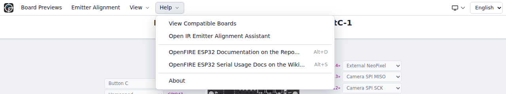
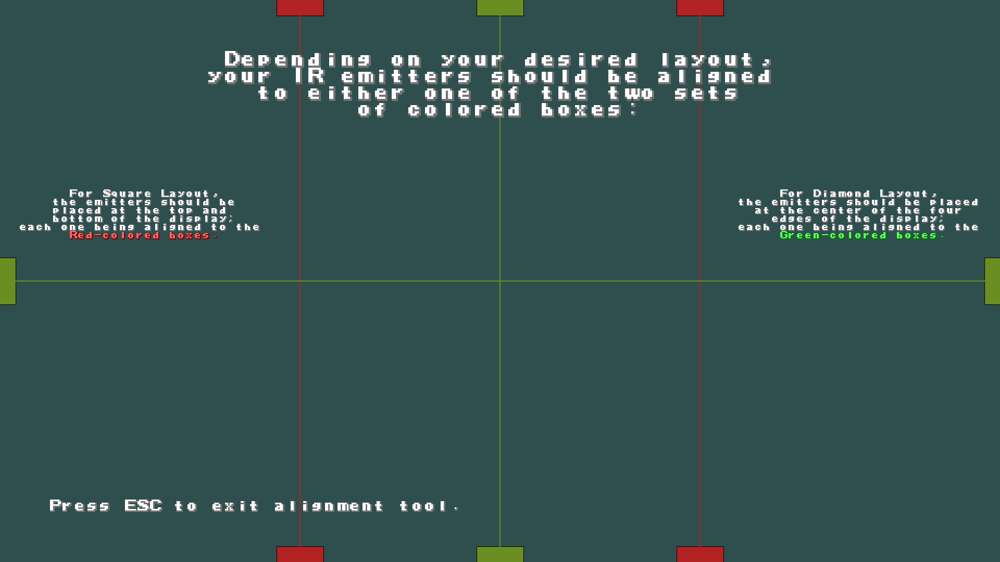
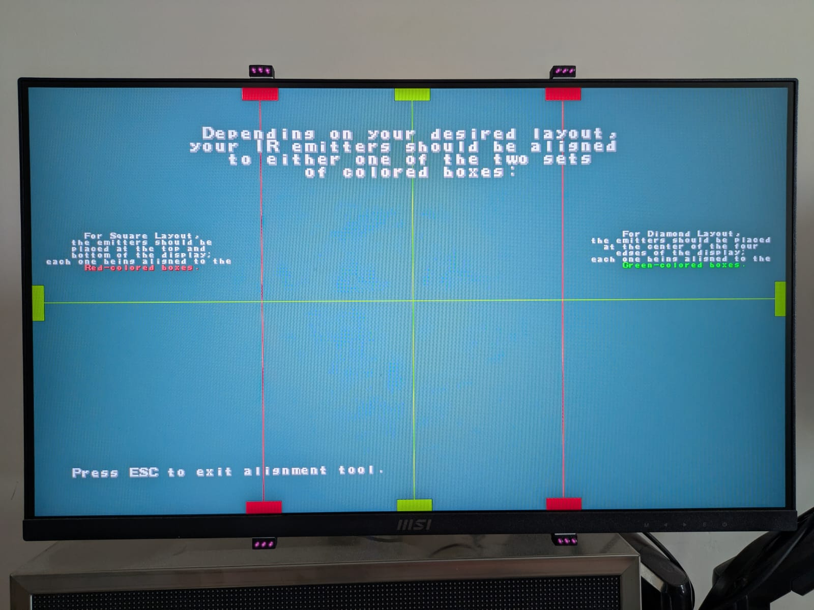
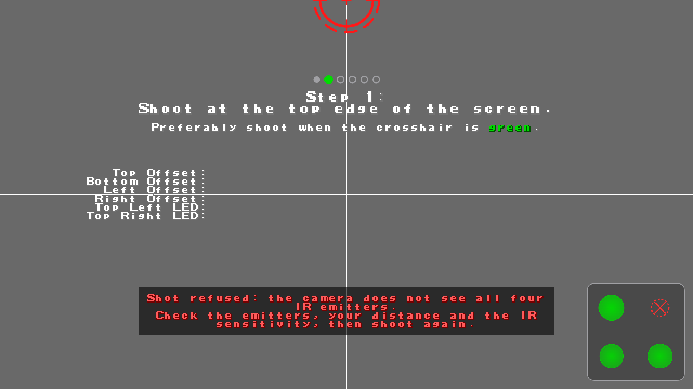
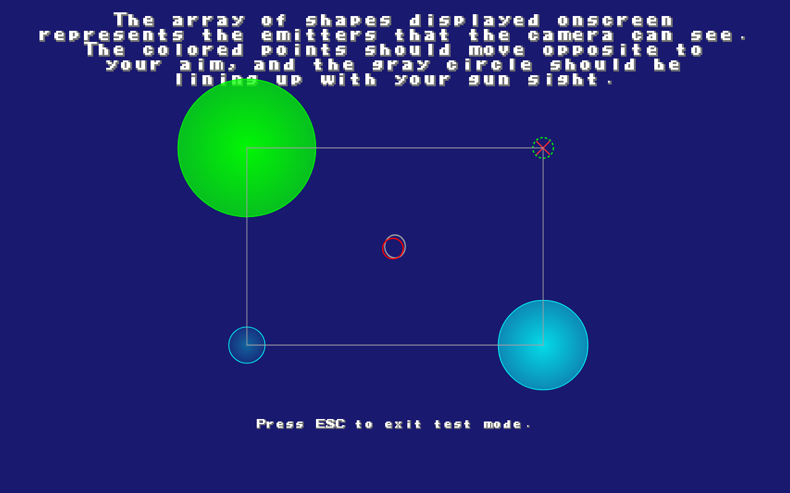

[Back to Home](../../README.md#english-version) / [Lightgun Firmware](../README.md#english-version) / **Operational Manual**

  <a href="#english-version"> English Version</a> &nbsp;•&nbsp; <a href="#versione-italiana"> Versione Italiana</a>

# OpenFIRE - The Enclosed Instruction Book!

*... adapted for ESP32 7.0.0 from the original [OpenFIRE](https://github.com/TeamOpenFIRE/OpenFIRE-Firmware/blob/OpenFIRE-dev/OpenFIREmain/README.md) project repository.*

This manual takes you from a freshly flashed gun to your first game: placing the IR emitters, configuring the gun, calibrating it, and everything you can do from the gun itself while playing.

## Table of Contents:
 - [IR Emitter Setup](#ir-emitter-setup)
 - [Board Configuration](#board-configuration)
   - [Configuration with the WebApp](#configuration-with-the-webapp)
   - [Special boot modes](#special-boot-modes)
   - [Camera, display and startup settings](#camera-display-and-startup-settings)
 - [First-time Setup](#first-time-setup)
 - [Operations Manual](#operations-manual)
   - [Your First Game](#your-first-game)
   - [Run Modes](#run-modes)
   - [Default Buttons](#default-buttons)
   - [Default Buttons in Pause Mode](#default-buttons-in-pause-mode-hotkey)
   - [Controls for Simple Pause Menu](#controls-for-simple-pause-menu)
   - [How to Calibrate](#how-to-calibrate)
   - [IR Camera Sensitivity](#ir-camera-sensitivity)
   - [Profiles](#profiles)
   - [Software Toggles](#software-toggles)
   - [Saving Settings to Flash](#saving-settings-to-flash)
   - [Test Mode](#test-mode)
 - [Common Problems](#common-problems)
 - [Known Limitations](#known-limitations)
 - [Force Feedback Programs and Multiplayer](#technical-details--assorted-errata)
   - [Serial Handoff (Mame Hooker) Mode](#serial-handoff-mame-hooker-mode)
   - [Multiple Guns and Multiplayer](#multiple-guns-and-multiplayer)

## IR Emitter Setup

The gun aims by watching four infrared emitters placed around the screen. They can be arranged in two ways:

 - **Square / rectangular layout (recommended):** two LEDs at the top and two at the bottom of the display, aligned in two columns. The best arrangement uses two pairs centred on the top and bottom edges, forming a vertical rectangle (narrower than it is tall), as shown by the alignment assistant. A wider rectangle with the four LEDs at the screen corners also works. Avoid a perfect square.
 - **Diamond layout:** one LED at the centre of each side of the display (top, bottom, left and right), not at the corners.

**Moving Square emitters to the screen corners:** keep **Square** selected in the calibration profile, calibrate again and save. There is no separate vertical or wide setting to choose: the gun works it out from the calibration.

Use **940 nm IR emitters for DFRobot/Wii** and **850 nm for PAJ7025R2/R3**. The wavelength must match the camera: raising the sensitivity cannot make up for the wrong LEDs or a poor placement.

With a DFRobot/Wii camera and a small PC monitor, two Wii sensor bars are enough, one above the screen and one below. On a TV, build or buy a set of high-power IR LEDs and arrange them like larger sensor bars at the top and bottom of the display.

The **OpenFIRE ESP32 WebApp** has an alignment assistant that shows where to place the emitters on your display: open it with the **Emitter Alignment** button in the menu bar, or from ***Help → Open IR Emitter Alignment Assistant***.

<table>
  <tr>
    <td valign="middle" width="33%">
      
    </td>
    <td valign="middle" width="33%">
      
    </td>
    <td valign="middle" width="33%">
      
    </td>
  </tr>
</table>

## Board Configuration

Everything is configured with the **OpenFIRE ESP32 WebApp**: pins and buttons, camera, calibration profiles, force feedback, plus input, feedback and IR camera tests. There are two ways to open it:

- **online**, from a computer browser with Web Serial support, such as Chrome or Edge;
- **[offline](#configuration-with-the-webapp)**, from the WebApp stored in the gun itself. It works with any current browser, including Firefox, Safari and phone browsers, and needs no Internet connection.

If you prefer a program to install, or your browser is too old for either WebApp, a compatible desktop App, based on the App of the original OpenFIRE project, can be downloaded from the [Tools page](https://alessandro-satanassi.github.io/OpenFIRE-ESP32-Tools/?lang=en) (also linked from the [project hub](https://alessandro-satanassi.github.io/OpenFIRE-ESP32/?lang=en)). Use the **OpenFIRE App CUSTOM for ESP32 7.x firmware** section: the other Apps on that page, including those of the original project, do not work with this firmware.

While a configuration page is connected, the gun is in configuration mode and does not act as a mouse or controller. Save your changes and wait for the confirmation before disconnecting or switching off. If a save is not confirmed, follow the message shown, reconnect and check the settings: do not assume the save went through.

### Configuration with the WebApp

**Online, from a computer:**

1. Switch on the lightgun normally, without holding any buttons. Connect its USB OTG port with a data cable, or plug in its paired wireless dongle.
2. Open the [WebApp](https://alessandro-satanassi.github.io/OpenFIRE-ESP32-WebApp/?lang=en) in Chrome or Edge.
3. Click **Connect a Lightgun** and choose the serial port of the lightgun (or of its dongle). The page recognises the firmware version and opens the WebApp made for it.
4. Configure, calibrate and test the gun, then save. Close other configuration pages and serial programs that could be using the same port.

**Offline, with the WebApp stored in the lightgun:**

Switch on the gun holding **B** for about 2 seconds (see [Special boot modes](#special-boot-modes)). No Internet connection and nothing to download.

- **Wi-Fi, phones included:** join the **OpenFIRE_Config** network. If a welcome page appears, choose to stay connected even without Internet (on some Android phones, the menu option to use the network as it is). Then open your **normal browser**, not the welcome window, and go to **http://openfire.local/**, or to **http://192.168.4.1/** if the name does not open.
- **USB cable:** on a computer that supports USB networking (NCM), connect the gun directly and open **http://192.168.7.1/** (**http://openfire.local/** may also work). Wi-Fi is not needed.
- **Battery-powered gun:** keep the dongle plugged in and paired: without a USB cable, the gun completes its startup, and turns on the **OpenFIRE_Config** network, only after connecting to the dongle. No USB cable is needed to configure it over Wi-Fi. Connecting the WebApp puts the gun in configuration mode: normal play is suspended until you disconnect.
- **Serial port:** in this mode the gun's USB serial port is replaced by the network connection. Online configuration and serial programs such as MAMEHOOKER are not available on the gun's USB port until you restart the gun normally. The dongle keeps its serial port, but do not use it with another program while the WebApp is connected to the gun.

Use one configuration page at a time. When you have finished, save, close the page and **restart the gun without holding any buttons** to return to normal play.

### Special boot modes

Hold the buttons **before switching on or resetting** the gun and keep them pressed for about **2 seconds**, until the mode starts. These shortcuts need a gun already running firmware 7.0.0, with its buttons mapped and working.

| Buttons held at startup | Result |
| --- | --- |
| None | Normal operation. |
| **Trigger + A** | Firmware update mode; the OLED, if fitted, shows **Ready for firmware update**. Connect the gun's own USB OTG port and use the [Web Flasher](https://alessandro-satanassi.github.io/OpenFIRE-ESP32-WebFlasher/?lang=en). |
| **B** | Offline WebApp over Wi-Fi and, with a USB cable, over USB networking. On the OLED the top bar is inverted and shows a gear icon. |

If both combinations are held, the firmware update takes priority. **A and B are the gun's own buttons, not the BOOT button on the board.** On a blank board, with older firmware or when the shortcuts cannot work, use the board's BOOT/RESET buttons instead.

You do not always need the shortcut: on a gun running normally, the Web Flasher can switch it to update mode by itself, and so can **Restart Microcontroller in Firmware Update Mode** in the WebApp's *Gun Tests* tab. After this restart the serial port changes: start the installation again and choose the new port. The firmware cannot be installed through the wireless dongle or over Wi-Fi.

When installing, choose the file for your **board and its flash/PSRAM variant**; the camera does not matter. **Base Update** keeps your settings, **Clean Install** erases all settings and calibrations and writes the same firmware. Coming from 6.2.1, a clean installation is recommended: note your settings first, then configure and calibrate again.

### Camera, display and startup settings

- **Camera:** in **Gun Settings → CAMERA Model**, choose **DFRobot SEN0158 / Wii**, **PAJ7025R2** or **PAJ7025R3** to match your camera (enable **Unlock CAMERA Modification** if the choice is locked). Then assign its pins in **Board Layout**: **Camera SDA** and **Camera SCL** for the DFRobot/Wii, or **Camera SPI MISO**, **MOSI**, **SCK** and **CS** for the PixArt cameras, besides power and ground. Save, and calibrate again after changing camera, lens or emitter placement. The R3's wider lens helps when playing close to the screen; it does not by itself give more accuracy or range. After a clean installation the camera is set to **DFRobot SEN0158 / Wii**: with a PAJ7025R2 or R3, select it and set its pins before calibrating, otherwise the WebApp reports **Device Error: Camera not available!**
- **OLED display:** disabled by default. Enable **Enable OLED Display (SSD1306 128x64)** in **Gun Settings → I2C Peripherals**, assign **Peripherals SDA** and **Peripherals SCL** in **Board Layout** to the pins the display is wired to, then save and restart. If the display stays blank, try **Use Alternative Device Address**.
- **Startup mode:** choose **Absolute Mouse** (default), **Gamepad (right stick)** or **Gamepad (left stick)** in **Gun Settings → Input / Output**, then save. This is the output used at the next normal startup; a force feedback program can still change it during a game.
- **Wireless pedal** (**Gun Settings → Input / Output**): enable it only if you use the wireless pedal, and leave both wired pedal inputs unmapped; otherwise disable it, so the gun does not search for a pedal at every start. A mapped wired pedal always takes priority. The wireless pedal works when the gun plays through the dongle; with the gun connected to the computer by USB cable, use a wired pedal.

## First-time Setup
After a new installation, or a clean installation, the gun has no calibration yet: it waits for the first one and does not move the pointer; the board's RGB LED, if present, blinks orange.

1. Connect the gun to the WebApp. If your wiring differs from the default pinout, map at least the *Trigger* and *Button A* in *Board Layout*; select your camera, check the buttons in the *Gun Tests* tab, then save.
2. Start the calibration with one of the *Calibrate Profile* buttons in the *Calibration Profiles* tab. If you prefer to calibrate from the gun, disconnect the App, restart normally and pull the trigger to start the procedure (see [How to Calibrate](#how-to-calibrate)).
3. After accepting the calibration in the App, save and wait for confirmation. The first calibration performed from the gun, when no calibration is stored, is saved automatically after you confirm it.

If the camera is not available (for example because the wrong model is selected), pulling the trigger does not start the calibration: fix the camera settings in the WebApp first.

## Operations Manual
The gun works as an absolute-positioning mouse: wherever you aim, the pointer goes. You can choose a gamepad output instead with the **Startup mode** setting, and a force feedback program such as MAMEHOOKER can switch it during a game (see [Serial Handoff](#serial-handoff-mame-hooker-mode)).

**How the computer sees the gun:** the gun, or its dongle, appears as standard USB devices (an absolute-positioning mouse, a keyboard and a gamepad), so no drivers are needed and games and emulators use it like any mouse or controller. The position is updated 209 times per second, about every 4.8 ms, over USB and wirelessly alike. To make the solenoid, rumble, LEDs and OLED counters follow what happens in the game, you also need a force feedback program such as MAMEHOOKER; without it, force feedback reacts to the trigger only.

Buttons in pause mode, and the combination that enters it, act when you release the last button of the combination: this is how the gun tells a combination from a single press.

While the gun is paused, and during the calibration started from the gun, any serial terminal (the Arduino IDE Serial Monitor, *PuTTY*, *screen*...) shows extra information, such as the current camera sensitivity.

### Your First Game

For a first test, use one gun with the default **Absolute Mouse** output:

1. Save the settings, disconnect and close the configuration App. If you started the offline WebApp by holding B, restart the gun without holding any buttons.
2. Aim at the desktop to check that the pointer follows your aim, then open your game or emulator.
3. In the game's input settings, enable mouse/lightgun input and select the gun as Player 1's aiming device, if the game offers a device selector. Map the trigger to fire and A/B to reload or the actions the game needs. By default they send the left, right and middle mouse buttons respectively; see [Default Buttons](#default-buttons).
4. Test aiming and the buttons in the game. Some games have their own calibration or require a particular input mode: follow their instructions. If aiming works on the desktop but not in the game, check the game's input settings before repeating the gun's calibration.

You do not need MAMEHOOKER just to aim and shoot. Set up [game-driven force feedback](#serial-handoff-mame-hooker-mode) afterwards, if you want the recoil, lights and counters to follow the game. For more than one gun, see [Multiple Guns and Multiplayer](#multiple-guns-and-multiplayer).

### Run Modes
Each profile has one of these modes:
1. **Normal** - the position follows every frame of the camera, with no averaging.
2. **Averaging** - the position is the average of the current and the previous frame.
3. **Averaging2** - the position is a weighted average of the current frame and the two previous ones.

The averaging modes slightly reduce jitter without adding noticeable lag. The ESP32 port already filters jitter on its own, so **Normal** is the recommended mode.

### Default Buttons
- Trigger: Left mouse button
- A: Right mouse button (in Low Buttons Mode, Start if pressed off-screen)
- B: Middle mouse button (in Low Buttons Mode, Select if pressed off-screen)
- C/Reload: Mouse button 4 / Side Button 1 / Back
- Pump Action (Cabela's and similar): Right mouse button
- Start: 1 key
- Select: 5 key
- Up/Down/Left/Right: Keyboard arrow keys
- Pedal: Mouse button 4 / Side Button 1 / Back
- Alt Pedal: Mouse button 5 / Side Button 2 / Forward
- C + Start: Esc key
- Home: enter pause mode

**Low Buttons Mode** (**Gun Settings → Input / Output**) is meant for guns with few buttons: when enabled, A and B pressed while aiming off-screen act as Start and Select. Every button can be remapped in the **Button Mapping** tab.

**Analog stick:** with **Analog Stick X** and **Analog Stick Y** assigned in **Board Layout**, the **Analog Stick** box of the **Button Mapping** tab chooses whether the stick works as a gamepad stick, the D-pad or the keyboard arrows. If a direction comes out reversed, for example pushing up moves down, enable **Invert X Axis** (left/right) or **Invert Y Axis** (up/down) and save; the **Gun Tests** tab shows the result straight away.

**Entering pause mode:** press C + Select (default), the *Home* button if you have one, or, if hold-to-pause is enabled, hold the trigger and A **while aiming away from the screen** (pointing at the floor works well).

**Which pause mode is active?** By default the gun uses the **Hotkey** pause mode: once paused, each button or combination listed below does its job directly. To use the **Simple Pause Menu** instead (a list of options scrolled with the buttons, easiest with an OLED display), enable **Simple Pause Menu** in **Gun Settings → UI and UX**. Pausing with Trigger + A needs **Hold to Pause Enabled** in the same group, where you also set the hold time. Save after changing these options.

#### Default Buttons in Pause mode (Hotkey)
- A, B, Start, Select: select a profile
- Start + A: Normal mode (no averaging)
- Start + B: averaging on, switching between the two averaging modes (a serial terminal shows which)
- B + Down: lower the IR camera sensitivity (a serial terminal shows the level)
- B + Up: raise the IR camera sensitivity (a serial terminal shows the level)
- C/Reload: exit pause mode
- Left: rumble on/off *(only without a rumble hardware switch)*
- Right: solenoid on/off *(only without a solenoid hardware switch)*
- Trigger: start calibration
- Start + Select: save settings to the gun's memory

#### Controls for Simple Pause Menu
- A or Up: move up
- B or Down: move down
- Trigger: select the option
- C: exit pause mode
  - Holding A or B for half the hold-to-pause time (just over a second with the default 2.5 seconds) also exits the menu.

Options, from first to last before the list starts again:
* Calibrate current profile (always the first option)
* Switch profiles (submenu)
  * Choose profile 1-4 with the navigation buttons and the trigger, or press C to go back.
* Save Settings (to the gun's memory)
* Rumble on/off *(when rumble is enabled and no switch is fitted)*
* Solenoid on/off *(when the solenoid is enabled and no switch is fitted)*
* Send the Esc key to the PC

### How to Calibrate

Calibration teaches the gun where the edges of your screen are, so the pointer lands exactly where you aim. Each profile has its own calibration; do it again after moving the emitters or changing the camera or lens.

**Before you start:** stand in front of the centre of the screen at your usual playing distance, hold the gun upright without rotating it around the barrel, and aim carefully at each target.

You can calibrate from the WebApp (or the desktop App), which guides you and checks the IR emitters at every shot, or directly from the gun.

**From the WebApp or the desktop App**

Open the *Calibration Profiles* tab and click the *Calibrate Profile* button of the profile you want. A full-screen window shows six targets in turn: centre, top edge, bottom edge, left edge, right edge and centre again. Shoot each target with the trigger.

- **Crosshair colour:** green when the camera sees all four emitters well, the best moment to shoot; orange when an emitter is weak (the shot is accepted, but a brighter emitter gives a steadier aim); red when an emitter is not seen.
- **Refused shots:** while the crosshair is red the shot is refused and the window explains why. Bring the missing emitter back into view (step back if it leaves the view at the screen edges), or check the emitter, your distance and the [camera sensitivity](#ir-camera-sensitivity), then shoot again.
- **IR LEDs panel**, bottom right: the four emitters in their layout (Square or Diamond), each in the same colour scale as the crosshair; the crosshair takes the colour of the weakest one. An emitter that is not seen is a red dashed circle with a red X.
- **Progress:** six dots above the title show which target you are on. A brief white flash on the crosshair confirms an accepted shot; the window then advances to the next step. The calibration is not saved yet at this point.
- **Legend**, bottom left: explains signal strength, the size of the IR points and the not-detected symbol.

After the last target the window switches to aim verification: aim around the screen, especially at the edges and corners, and check that the pointer stays on your line of sight. Pull the trigger to accept, press A or B to repeat the calibration, or press C to leave without changes (in the WebApp, ESC on the keyboard works too). Then **save**.

  

**From the gun**

At the first startup after a new or clean installation, pull the trigger once to start the procedure. This first press is not a calibration shot: it is followed by **six target shots** (centre, top, bottom, left, right, centre), then a trigger press to confirm the aim check. For later calibrations, enter pause mode and select the profile as described below.

1. Select the profile to calibrate, with A/B/Start/Select in Hotkey pause mode or from the Simple Pause Menu, and pull the trigger.
2. Aim at the centre of the screen and pull the trigger while keeping a steady aim.
3. The cursor moves to the four edges in turn: top, bottom, left and right. At each edge it traces a small circle touching the edge: shoot **the point where the circle touches the screen edge**, not the centre of the circle.
4. When the cursor returns to the centre, aim at the centre of its small circle and shoot.
5. The new calibration is applied so you can check it: aim at the edges and corners and see that the pointer stays on your line of sight.
   - Pull the trigger to accept the calibration.
   - Press A or B to start again from step 2.
   - Press C/Reload at any time, or A/B before the final check, to cancel and keep the previous calibration. During the very first calibration after a clean installation the buttons cannot cancel it; in the WebApp, ESC still closes the calibration window.

With an OLED display, the screen below the status bar guides you: a small TV with a crosshair shows where the current target is on your monitor, together with the step (**1/6** to **6/6**) and `SHOOT`. At the end it shows `CHECK AIM`, `TRIGGER: CONFIRM` and `A/B: REPEAT`. The white dots on the display are the emitter positions the gun is tracking; some may be estimated, so four dots do not guarantee that the camera really sees all four emitters. The checks on the emitters are only available in the WebApp and desktop App windows.

The first calibration performed from the gun, when no calibration is stored, is **saved automatically** when you confirm it. A calibration started from pause mode stays active only until you switch the gun off: **save it**, with Start + Select in Hotkey pause mode, with Save Settings in the Simple Pause Menu, or from the WebApp. Otherwise the previous saved calibration is restored at the next startup.

### IR Camera Sensitivity
The camera sensitivity can be adjusted per profile. Keep it as high as possible: too low and the pointer loses precision, too high and the camera may pick up reflections that make the pointer jump. The best value depends on your setup: emitter brightness, distance, camera lens and shiny surfaces nearby.

- **Too low:** the pointer moves in coarse steps, as if it had a low resolution. If this happens at maximum sensitivity, the emitters are not bright enough.
- **Too high:** the pointer jumps around erratically. If it happens only when aiming at certain areas of the screen, the camera is seeing a reflection. Lower the sensitivity one step, or better, remove or cover the reflective surface.

The WebApp's IR test (see [Test Mode](#test-mode)) shows every IR point the camera sees, with its size and brightness, which makes reflections easy to find.

### Profiles
The gun has 4 calibration profiles, each with its own calibration, run mode, IR camera sensitivity and IR layout. Select one from pause mode with its button (A/B/Start/Select) or from the profiles submenu of the Simple Pause Menu. The WebApp's **Calibration Profiles** tab shows and changes every profile setting, including **Sensitivity** and **Run Mode**, which pause mode only reports on a serial terminal. Save after changing them.

### Software Toggles
When no hardware switch is fitted, rumble and solenoid can be switched on and off from pause mode (the board's built-in LED shows the colour):
- Left D-Pad: **Rumble** (salmon) - the motor runs briefly when it is switched on.
- Right D-Pad: **Solenoid** (yellow) - the solenoid fires briefly when it is switched on.

The Simple Pause Menu has the same options. The state is kept when you save and restored at the next start.

#### Saving Settings to Flash
Calibrations, profile settings and gun options such as pin mapping and rumble strength are saved in the gun's memory with Start + Select in Hotkey pause mode, with Save Settings in the Simple Pause Menu, or by saving in the WebApp and waiting for the confirmation. The profile selected when you save becomes the one used at the next start; gun settings (pins, force feedback, etc.) apply to *all profiles*. In the WebApp and the desktop App, **Save and Send Settings** pulses while there are unsaved changes.

#### Test Mode
The IR camera test shows the IR points as the camera sees them. Open it from the WebApp's *Gun Tests* tab with **Open IR Camera Tester...**. Use it to align the camera while building the gun, to check that all four emitters are tracked and to find reflections. The test uses the settings stored in the gun, so save any change to the IR layout or the sensitivity before opening it; the shape joining the points (a rectangle for Square, a diamond for Diamond) follows the layout of the current profile.

Each emitter circle shows what the camera measures:
- **Size:** follows the size of the light spot. Moving away from the screen makes it only slightly smaller, because it depends mostly on the LED brightness and the camera optics.
- **Fill:** brightest at the centre and fading towards the edge. A full circle is a bright, well detected LED; an almost empty one is a weak LED close to the detection limit.
- **Dashed circle with a red X:** the camera does not see that emitter; its position is only estimated.

The grey crosshair shows where the gun is aiming and the red circle marks the centre of the four emitters. The legend at the bottom left explains every symbol and underlines the layout in use. Green and cyan only tell the emitters apart; they say nothing about signal quality.

  

## Common Problems

- **After the installation the gun does nothing and the pointer does not move:** a new or clean-installed gun waits for its first calibration (the board's RGB LED, if present, blinks orange). Pull the trigger to calibrate, or calibrate from the WebApp; see [First-time Setup](#first-time-setup).
- **The WebApp does not find the gun's port:** use a USB **data** cable (some cables only charge) and Chrome or Edge on a computer; other browsers can use the [offline WebApp](#configuration-with-the-webapp), and for a browser too old for both see the desktop App in [Board Configuration](#board-configuration). On boards with two USB connectors use the one wired to the ESP32-S3's own USB (OTG): on the DevKitC-1, seen from above with the connectors pointing away from you, it is the one on the right, in front of the built-in NeoPixel LED (the board picture in the WebApp's **Board Layout** tab labels it **USB OTG**). Close other WebApp pages, serial monitors and MAMEHOOKER, which can keep the port busy. If the gun was started holding **B**, its serial port is replaced by the offline WebApp network: restart without holding any buttons.
- **WebApp message "Device Error: Camera not available!":** after a clean installation the camera is set to **DFRobot SEN0158 / Wii**. With a PAJ7025R2 or R3, select it in **Gun Settings → CAMERA Model**, set its pins in **Board Layout**, then save and restart. Otherwise check the camera power and that its wires are neither swapped nor assigned to other functions.
- **No IR points in the test, or some are missing:** check that the emitters are on and suit the camera (940 nm for DFRobot/Wii, 850 nm for PAJ7025R2/R3), that the camera can see the whole layout, and that the sensitivity is not too low. Save the sensitivity before opening the test.
- **Calibration does not move on to the next target:** in the WebApp or desktop App a target shot is refused while the camera does not see all four emitters (red crosshair). In the IR LEDs panel, an emitter marked with a red X must come back into view (step back if it leaves the view at the screen edges); also check that emitter, your distance and the [camera sensitivity](#ir-camera-sensitivity). See [How to calibrate](#how-to-calibrate).
- **The pointer does not follow the sight:** calibrate again standing in front of the centre of the screen, without rotating the gun, and check that the profile uses the right IR layout (Square or Diamond).
- **The pointer jumps or shakes:** usually a reflection or another light source (window, lamp, shiny surface) seen as an extra IR point. Find it in the [IR test](#test-mode), remove or cover it, or lower the [camera sensitivity](#ir-camera-sensitivity). Calibrate again after moving the emitters.
- **The gun does not pair with the dongle:** plug in the dongle first and wait about 15 seconds, then switch on the gun without its USB cable connected to the computer (with the cable it plays wired). After unplugging or restarting the dongle, restart the gun as well. Use one dongle per gun, with lightgun and dongle firmware from the same release ([dongle guide](../../dongle/README.md#english-version)).
- **The wireless pedal is not found:** it works only with a gun playing through the dongle. Enable **Wireless pedal**, leave both wired pedal inputs unmapped and save; switch on the pedal before the gun. After restarting the pedal, restart the gun as well.
- **The OLED display stays blank:** it is disabled by default; enable it as explained in [Camera, display and startup settings](#camera-display-and-startup-settings).
- **The temperature reading is far too high** (for example about 90 °C at room temperature): give the TMP36 its own ground wire to the board, not shared with the camera ([wiring tip](../README.md#optional-modules)).
- **The wireless connection drops or has a short range:** keep a small clear area around the antenna of the gun's board, with no wires over or right next to it and no metal covering it ([antenna tip](../README.md#mandatory-components-essentials)); the same applies to a home-made dongle or pedal. Also use solenoid power wires of at least 24 AWG, as thinner wires can cause disconnections.

Some behaviours are limits of the system rather than faults: see [Known Limitations](#known-limitations).

## Known Limitations

- The refined tracking applies to the Square layout; the Diamond layout uses the original OpenFIRE tracking.
- Wireless play needs an ESP32-S3 board; on RP2040 boards the firmware works by USB cable only.
- Up to four guns can play together; each gun playing wirelessly needs its own dongle, and the wireless pedal works only with a gun playing through the dongle.
- The firmware is installed through each device's own USB port, not through the dongle or over Wi-Fi.
- While the gun runs the offline WebApp (B held at startup), its USB serial port, and therefore MAMEHOOKER on that port, is not available until a normal restart.
- Configuration Apps for firmware older than 7.0.0, including those of the original OpenFIRE project, do not work with this firmware; use the WebApp or the compatible desktop App (see [Board Configuration](#board-configuration)).

## Force Feedback Programs and Multiplayer

### Serial Handoff (Mame Hooker) Mode

Force feedback programs talk to the gun through its USB serial port (or the dongle's), so start the gun normally (not in the offline WebApp mode) and close the WebApp before starting them.

When MAMEHOOKER, or a similar program, sends its start code, the gun hands control of the feedback to it. The board's LED and any *non-static* external NeoPixels turn a mid-intensity white to show it, until the game sends its own LED commands.

If you are new to MAMEHOOKER: **you need a compatible ini file for each game**, and **the gun's COM port must match the player number** (COM1 for P1, COM2 for P2, etc.). Set the COM port in the Windows Device Manager, or on Linux in the Wine registry of the prefix where the game and MAMEHOOKER run. Windows keeps the same COM port for the same gun, even through another USB port or its dongle. [The MAMEHOOKER wiki page explains everything step by step.](https://github.com/alessandro-satanassi/OpenFIRE-Firmware-ESP32/wiki/MAMEHOOKER_Documentation_EN) On Linux, to use the force feedback of native emulators (currently MAME, Flycast or their RetroArch cores), try [QMamehook](https://github.com/SeongGino/QMamehook).

### Multiple Guns and Multiplayer
To play with two or more guns on the same computer, each gun must have its own identity. If several guns share the same name and/or USB Product/Vendor ID, programs that read each mouse separately, such as RetroArch and TeknoParrot, cannot tell them apart.

1. Connect one gun at a time to the WebApp and open **Gun Settings → TinyUSB Identifier**.
2. Choose the player with the **P1**–**P4** buttons: **P1** for the first gun, **P2** for the second, and so on. After a clean installation every gun is **P1**. **Advanced View** lets you enter a custom Product ID and name instead.
3. Save and restart the gun.

The player number also sets the Start and Select keys (P1: 1 and 5, P2: 2 and 6, P3: 3 and 7, P4: 4 and 8; a custom ID keeps the P1 keys), appears on the OLED displays and on the pedal LEDs, and is the number to use for the MAMEHOOKER COM port (COM1 for P1, COM2 for P2, etc.).

**Wireless play with several guns:** up to four guns can play wirelessly, each with **its own dongle** and, if you like, its own wireless pedal; each dongle pairs with one gun only. It does not matter which dongle a gun pairs with: the dongle takes on the identity of the gun (name, player number and USB serial number), so the computer always sees P1 as P1. Pairing and radio channels are automatic; there is nothing to set.

If you like, set up one gun at a time: plug in the first dongle, wait about 15 seconds, switch on the first pedal and then the first gun, then do the same for the next one. This way each dongle picks its channel taking into account the interference of the dongles and guns already in use, and each pedal pairs with the intended gun, since a pedal pairs with the first gun that looks for it.

---
### Questions or Issues?
For technical support and to join the discussion, see the [Community & Support section](../../README.md#community-support-english) on the project's home page.

---

[Torna alla Home](../../README.md#versione-italiana) / [Lightgun Firmware](../README.md#versione-italiana) / **Manuale Operativo**

  <a href="#english-version"> English Version</a> &nbsp;•&nbsp; <a href="#versione-italiana"> Versione Italiana</a>

# OpenFIRE - Il Manuale di utilizzo!

*... adattato per ESP32 7.0.0 dal progetto originale [OpenFIRE](https://github.com/TeamOpenFIRE/OpenFIRE-Firmware/blob/OpenFIRE-dev/OpenFIREmain/README.md).*

Questo manuale ti accompagna da una pistola con il firmware appena installato alla prima partita: posizionamento degli emettitori IR, configurazione, calibrazione e tutto quello che puoi fare dalla pistola mentre giochi.

## Indice:
 - [Configurazione Emettitori IR](#configurazione-emettitori-ir-italiano)
 - [Configurazione della Scheda](#configurazione-della-scheda-italiano)
   - [Configurazione con la WebApp](#configurazione-con-la-webapp)
   - [Modalità speciali all'avvio](#modalita-speciali-allavvio)
   - [Telecamera, display e impostazioni di avvio](#telecamera-display-e-impostazioni-di-avvio)
 - [Prima Configurazione](#prima-configurazione-italiano)
 - [Manuale Operativo](#manuale-operativo-italiano)
   - [La prima partita](#la-prima-partita)
   - [Modalità di Funzionamento](#modalità-di-funzionamento-italiano)
   - [Pulsanti Predefiniti](#pulsanti-predefiniti-italiano)
   - [Pulsanti Predefiniti in Modalità Pausa](#pulsanti-predefiniti-in-modalità-pausa-hotkey-italiano)
   - [Controlli per il Menu di Pausa Semplificato](#controlli-per-il-menu-di-pausa-semplificato-italiano)
   - [Come Calibrare](#come-calibrare-italiano)
   - [Sensibilità della Telecamera IR](#sensibilità-della-telecamera-ir-italiano)
   - [Profili](#profili-italiano)
   - [Interruttori Software (Toggle)](#interruttori-software-toggle-italiano)
   - [Salvataggio delle Impostazioni nella Flash](#salvataggio-delle-impostazioni-nella-flash-italiano)
   - [Modalità di Test](#modalità-di-test-italiano)
 - [Problemi Comuni](#problemi-comuni-italiano)
 - [Limiti noti](#limiti-noti-italiano)
 - [Programmi di force feedback e multigiocatore](#dettagli-tecnici-e-note-varie-italiano)
   - [Modalità Serial Handoff (Mame Hooker)](#modalità-serial-handoff-mame-hooker-italiano)
   - [Più pistole e multigiocatore](#modifica-dell-id-usb-per-pistole-multiple-italiano)

## Configurazione Emettitori IR

La pistola punta osservando quattro emettitori a infrarossi posizionati intorno allo schermo. Si possono disporre in due modi:

 - **Layout Square / rettangolare (consigliato):** due LED sopra e due sotto lo schermo, allineati su due colonne. La disposizione migliore usa due coppie centrate sui bordi superiore e inferiore, che formano un rettangolo verticale (più alto che largo), come mostra l'assistente di allineamento. Funziona anche un rettangolo più largo con i quattro LED agli angoli dello schermo. Evita un quadrato perfetto.
 - **Layout Diamond / a rombo:** un LED al centro di ciascun lato dello schermo (alto, basso, sinistra e destra), non agli angoli.

**Se sposti gli emettitori Square agli angoli dello schermo:** mantieni **Square** selezionato nel profilo, calibra di nuovo e salva. Non c'è un'impostazione separata per il rettangolo verticale o largo: la pistola lo ricava dalla calibrazione.

Usa **emettitori IR da 940 nm per DFRobot/Wii** e **da 850 nm per PAJ7025R2/R3**. La lunghezza d'onda deve corrispondere alla telecamera: aumentare la sensibilità non rimedia a LED sbagliati o a un posizionamento scorretto.

Con una telecamera DFRobot/Wii e un piccolo monitor per PC bastano due barre sensore Wii, una sopra lo schermo e una sotto. Su una TV costruisci o acquista un set di LED IR ad alta potenza e disponili come barre sensore più grandi, sopra e sotto lo schermo.

La **WebApp OpenFIRE ESP32** ha un assistente di allineamento che mostra dove posizionare gli emettitori sul tuo schermo: aprilo con il pulsante **Allineamento Sensore** nella barra dei menu, oppure da ***Aiuto → Apri Assistente allineamento emettitori IR***.

<table>
  <tr>
    <td valign="middle" width="33%">
      
    </td>
    <td valign="middle" width="33%">
      
    </td>
    <td valign="middle" width="33%">
      
    </td>
  </tr>
</table>

## Configurazione della Scheda

Tutto si configura con la **WebApp OpenFIRE ESP32**: pin e pulsanti, telecamera, profili di calibrazione, force feedback, oltre ai test degli ingressi, dei feedback e della telecamera IR. Puoi aprirla in due modi:

- **online**, dal browser di un computer con supporto Web Serial, come Chrome o Edge;
- **[offline](#configurazione-con-la-webapp)**, dalla WebApp contenuta nella pistola stessa. Funziona con qualsiasi browser attuale, compresi Firefox, Safari e i browser dei telefoni, e non richiede Internet.

Se preferisci un programma da installare, o il tuo browser è troppo vecchio per entrambe le WebApp, un'App desktop compatibile, basata sull'App del progetto OpenFIRE originale, si scarica dalla [pagina Tools](https://alessandro-satanassi.github.io/OpenFIRE-ESP32-Tools/?lang=it) (raggiungibile anche dal [portale del progetto](https://alessandro-satanassi.github.io/OpenFIRE-ESP32/?lang=it)). Usa la sezione **OpenFIRE App CUSTOM per firmware ESP32 7.x**: le altre App di quella pagina, comprese quelle del progetto originale, non funzionano con questo firmware.

Mentre una pagina di configurazione è collegata, la pistola è in modalità configurazione e non funziona come mouse o controller. Salva le modifiche e attendi la conferma prima di scollegarla o spegnerla. Se un salvataggio non viene confermato, segui il messaggio mostrato, ricollegati e controlla le impostazioni: non darlo per riuscito.

### Configurazione con la WebApp

**Online, da computer:**

1. Accendi la lightgun normalmente, senza tenere premuti pulsanti. Collega la sua porta USB OTG con un cavo dati, oppure inserisci il dongle wireless associato.
2. Apri la [WebApp](https://alessandro-satanassi.github.io/OpenFIRE-ESP32-WebApp/?lang=it) con Chrome o Edge.
3. Fai clic su **Collega una lightgun** e scegli la porta seriale della lightgun (o del suo dongle). La pagina riconosce la versione del firmware e apre la WebApp della stessa versione.
4. Configura, calibra e prova la pistola, poi salva. Chiudi altre pagine di configurazione e programmi seriali che potrebbero usare la stessa porta.

**Offline, con la WebApp contenuta nella lightgun:**

Accendi la pistola tenendo premuto **B** per circa 2 secondi (vedi [Modalità speciali all'avvio](#modalita-speciali-allavvio)). Niente Internet e niente da scaricare.

- **Wi-Fi, anche da telefono:** collegati alla rete **OpenFIRE_Config**. Se compare una pagina di benvenuto, scegli di restare connesso anche senza Internet (su alcuni Android: la voce del menu per usare la rete così com'è). Poi apri il **browser normale**, non la finestra di benvenuto, e vai su **http://openfire.local/**, oppure su **http://192.168.4.1/** se il nome non si apre.
- **Cavo USB:** su un computer che supporta la rete via USB (NCM), collega direttamente la pistola e apri **http://192.168.7.1/** (può funzionare anche **http://openfire.local/**). Il Wi-Fi non serve.
- **Pistola a batteria:** tieni il dongle inserito e associato: senza cavo USB la pistola completa l'avvio, e attiva la rete **OpenFIRE_Config**, solo dopo essersi collegata al dongle. Per configurarla via Wi-Fi non serve il cavo USB. Quando colleghi la WebApp la pistola entra in modalità configurazione: il gioco normale è sospeso fino alla disconnessione.
- **Porta seriale:** in questa modalità la porta seriale USB della pistola è sostituita dal collegamento di rete. La configurazione online e i programmi seriali come MAMEHOOKER non sono disponibili sulla porta USB della pistola finché non la riavvii normalmente. Il dongle mantiene la propria porta seriale, ma non usarla con un altro programma mentre la WebApp è collegata alla pistola.

Usa una sola pagina di configurazione alla volta. Al termine salva, chiudi la pagina e **riavvia la pistola senza tenere premuti pulsanti** per tornare al gioco normale.

### Modalità speciali all'avvio

Tieni premuti i pulsanti **prima di accendere o riavviare** la pistola e mantienili per circa **2 secondi**, finché la modalità non parte. Queste scorciatoie richiedono una pistola che esegue già il firmware 7.0.0, con i pulsanti mappati e funzionanti.

| Pulsanti tenuti premuti all'avvio | Risultato |
| --- | --- |
| Nessuno | Funzionamento normale. |
| **Grilletto + A** | Modalità aggiornamento firmware; sull'OLED, se presente, compare **Ready for firmware update**. Collega la porta USB OTG della pistola stessa e usa il [Web Flasher](https://alessandro-satanassi.github.io/OpenFIRE-ESP32-WebFlasher/?lang=it). |
| **B** | WebApp offline via Wi-Fi e, con il cavo USB, via rete USB. Sull'OLED la barra superiore ha i colori invertiti e mostra un ingranaggio. |

Se tieni premute entrambe le combinazioni, ha la precedenza l'aggiornamento del firmware. **A e B sono i pulsanti della pistola, non il pulsante BOOT della scheda.** Su una scheda vuota, con un firmware precedente o quando le scorciatoie non funzionano, usa invece i pulsanti BOOT/RESET della scheda.

La scorciatoia non serve sempre: su una pistola in funzionamento normale il Web Flasher può portarla da solo in modalità aggiornamento, e lo stesso fa **Riavvia il microcontrollore in modalità aggiornamento firmware** nella scheda *Gun Tests* della WebApp. Dopo questo riavvio la porta seriale cambia: avvia di nuovo l'installazione e scegli la nuova porta. Il firmware non si può installare attraverso il dongle wireless o via Wi-Fi.

Per l'installazione scegli il file della tua **scheda e della sua variante flash/PSRAM**; la telecamera non conta. **Aggiornamento Base** conserva le impostazioni, **Installazione Pulita** cancella tutte le impostazioni e calibrazioni e scrive lo stesso firmware. Passando dalla 6.2.1 è consigliata un'installazione pulita: annota prima le impostazioni, poi configura e calibra di nuovo.

### Telecamera, display e impostazioni di avvio

- **Telecamera:** in **Impostazioni Gun → Modello TELECAMERA** scegli **DFRobot SEN0158 / Wii**, **PAJ7025R2** o **PAJ7025R3** secondo la tua telecamera (attiva **Sblocca modifica TELECAMERA** se la scelta è bloccata). Poi assegna i suoi pin nel **Layout Scheda**: **SDA telecamera** e **SCL telecamera** per la DFRobot/Wii, oppure **SPI MISO**, **MOSI**, **SCK** e **CS telecamera** per le PixArt, oltre ad alimentazione e massa. Salva, e calibra di nuovo dopo aver cambiato telecamera, lente o posizione degli emettitori. L'ottica grandangolare della R3 aiuta quando si gioca vicino allo schermo; da sola non garantisce più precisione o portata. Dopo un'installazione pulita la telecamera impostata è **DFRobot SEN0158 / Wii**: con una PAJ7025R2 o R3 selezionala e imposta i suoi pin prima di calibrare, altrimenti la WebApp segnala **Errore dispositivo: Fotocamera non disponibile!**
- **Display OLED:** disattivato per impostazione predefinita. Attiva **Abilita Display OLED (SSD1306 128x64)** in **Impostazioni Gun → Periferiche I2C**, assegna nel **Layout Scheda** **SDA periferiche** e **SCL periferiche** ai pin a cui è collegato il display, poi salva e riavvia. Se il display resta spento, prova **Usa Indirizzo Dispositivo Alternativo**.
- **Modalità all'avvio:** scegli **Mouse assoluto** (predefinito), **Gamepad (stick destro)** o **Gamepad (stick sinistro)** in **Impostazioni Gun → Input / Output**, poi salva. È l'uscita usata al successivo avvio normale; un programma di force feedback può comunque cambiarla durante il gioco.
- **Pedale wireless** (**Impostazioni Gun → Input / Output**): attivalo solo se usi il pedale wireless e lascia non assegnati entrambi gli ingressi dei pedali cablati; altrimenti disattivalo, così la pistola non cerca un pedale a ogni avvio. Un pedale cablato mappato ha sempre la precedenza. Il pedale wireless funziona quando la pistola gioca tramite il dongle; con la pistola collegata al computer via cavo USB, usa un pedale cablato.

## Prima Configurazione
Dopo una nuova installazione, o un'installazione pulita, la pistola non ha ancora una calibrazione: attende la prima e non muove il puntatore; il LED RGB della scheda, se presente, lampeggia in arancione.

1. Collega la pistola alla WebApp. Se il tuo cablaggio è diverso dal pinout predefinito, assegna almeno il *Grilletto* e il *Pulsante A* nel *Layout Scheda*; scegli la telecamera, prova i pulsanti nella scheda *Gun Tests*, poi salva.
2. Avvia la calibrazione con uno dei pulsanti *Calibra profilo* nella scheda *Profili di calibrazione*. Se preferisci calibrare dalla pistola, disconnetti l'App, riavvia normalmente e premi il grilletto per avviare la procedura (vedi [Come Calibrare](#come-calibrare-italiano)).
3. Dopo aver accettato la calibrazione nell'App, salva e attendi la conferma. La prima calibrazione eseguita dalla pistola, quando non ne è presente una salvata, viene memorizzata automaticamente dopo la conferma.

Se la telecamera non è disponibile (ad esempio perché è selezionato il modello sbagliato), premendo il grilletto la calibrazione non parte: correggi prima le impostazioni della telecamera nella WebApp.

## Manuale Operativo
La pistola funziona come un mouse a posizionamento assoluto: dove miri, va il puntatore. Con l'impostazione **Modalità all'avvio** puoi scegliere invece un'uscita gamepad, e un programma di force feedback come MAMEHOOKER può cambiarla durante il gioco (vedi [Modalità Serial Handoff](#modalità-serial-handoff-mame-hooker-italiano)).

**Come il computer vede la pistola:** la pistola, o il suo dongle, viene riconosciuta come normali dispositivi USB (un mouse a posizionamento assoluto, una tastiera e un gamepad): non servono driver e giochi ed emulatori la usano come un qualsiasi mouse o controller. La posizione viene aggiornata 209 volte al secondo, circa ogni 4,8 ms, sia via USB sia senza fili. Per far seguire a solenoide, rumble, LED e contatori dell'OLED quello che accade nel gioco serve anche un programma di force feedback come MAMEHOOKER; senza, il force feedback reagisce solo al grilletto.

I pulsanti in modalità pausa, e la combinazione per entrarci, agiscono quando rilasci l'ultimo pulsante della combinazione: così la pistola distingue una combinazione da una pressione singola.

Mentre la pistola è in pausa, e durante la calibrazione avviata dalla pistola, qualsiasi terminale seriale (il Monitor Seriale dell'IDE Arduino, *PuTTY*, *screen*...) mostra informazioni aggiuntive, come la sensibilità attuale della telecamera.

### La prima partita

Per una prima prova usa una sola pistola con l'uscita predefinita **Mouse Assoluto**:

1. Salva le impostazioni, disconnetti e chiudi l'App di configurazione. Se hai avviato la WebApp offline tenendo premuto B, riavvia la pistola senza tenere premuti pulsanti.
2. Mira sul desktop per controllare che il puntatore segua la tua mira, poi apri il gioco o l'emulatore.
3. Nelle impostazioni dei comandi del gioco abilita l'ingresso mouse/lightgun e seleziona la pistola per il puntamento del giocatore 1, se il gioco permette di scegliere il dispositivo. Associa il grilletto allo sparo e A/B alla ricarica o alle azioni richieste dal gioco. Per impostazione predefinita inviano rispettivamente i pulsanti sinistro, destro e centrale del mouse; vedi [Pulsanti Predefiniti](#pulsanti-predefiniti-italiano).
4. Prova puntamento e pulsanti nel gioco. Alcuni giochi hanno una propria calibrazione o richiedono una particolare modalità di ingresso: segui le loro istruzioni. Se il puntamento funziona sul desktop ma non nel gioco, controlla i comandi del gioco prima di ripetere la calibrazione della pistola.

Per mirare e sparare non serve MAMEHOOKER. Puoi configurare in seguito il [force feedback comandato dal gioco](#modalità-serial-handoff-mame-hooker-italiano), se vuoi che rinculo, luci e contatori seguano la partita. Per più pistole vedi [Più pistole e multigiocatore](#modifica-dell-id-usb-per-pistole-multiple-italiano).

### Modalità di Funzionamento
Ogni profilo usa una di queste modalità:
1. **Normal** - la posizione segue ogni frame della telecamera, senza medie.
2. **Averaging** - la posizione è la media del frame attuale e di quello precedente.
3. **Averaging2** - la posizione è una media ponderata del frame attuale e dei due precedenti.

Le modalità *Averaging* riducono un po' il tremolio senza aggiungere ritardo percepibile. Il porting ESP32 filtra già il tremolio da solo, quindi la modalità consigliata è **Normal**.

### Pulsanti Predefiniti
- **Grilletto (Trigger):** tasto sinistro del mouse
- **A:** tasto destro del mouse (con la modalità pulsanti 'fuori schermo', Start se premuto puntando fuori dallo schermo)
- **B:** tasto centrale del mouse (con la modalità pulsanti 'fuori schermo', Select se premuto puntando fuori dallo schermo)
- **C/Reload:** tasto mouse 4 / pulsante laterale 1 / Indietro
- **Pump Action (ricarica a pompa, es. Cabela's):** tasto destro del mouse
- **Start:** tasto 1 della tastiera
- **Select:** tasto 5 della tastiera
- **Su/Giù/Sinistra/Destra:** frecce direzionali della tastiera
- **Pedale:** tasto mouse 4 / pulsante laterale 1 / Indietro
- **Pedale alternativo:** tasto mouse 5 / pulsante laterale 2 / Avanti
- **C + Start:** tasto Esc della tastiera
- **Home:** entra in modalità pausa

La **Modalità pulsanti 'fuori schermo'** (**Impostazioni Gun → Input / Output**; in inglese *Low Buttons Mode*) è pensata per pistole con pochi pulsanti: quando è attiva, A e B premuti puntando fuori dallo schermo funzionano come Start e Select. Ogni pulsante si può rimappare nella scheda **Mappatura Pulsanti**.

**Stick analogico:** con **Stick analogico X** e **Stick analogico Y** assegnati in **Layout Scheda**, il riquadro **Stick Analogico** della scheda **Mappatura Pulsanti** sceglie se lo stick funziona come stick del gamepad, D-pad o frecce della tastiera. Se una direzione risulta invertita, per esempio spingendo in su il movimento va in giù, attiva **Inverti asse X** (sinistra/destra) o **Inverti asse Y** (su/giù) e salva; la scheda **Gun Tests** mostra subito il risultato.

**Entrare in modalità pausa:** premi **C + Select** (impostazione predefinita), il pulsante **Home** se lo hai, oppure, se la pausa con pressione prolungata è attiva, tieni premuti il grilletto e A **puntando fuori dallo schermo** (verso il pavimento va benissimo).

**Quale modalità di pausa è attiva?** Per impostazione predefinita la pistola usa la modalità di pausa **Hotkey**: una volta in pausa, ogni pulsante o combinazione elencata sotto esegue direttamente la sua funzione. Per usare invece il **Menu di Pausa Semplificato** (un elenco di opzioni da scorrere con i pulsanti, più comodo con un display OLED), attiva **Menu pausa semplice** in **Impostazioni Gun → UI e UX**. Per entrare in pausa con Grilletto + A serve **Abilita pausa con pressione prolungata** nello stesso gruppo, dove imposti anche il tempo di pressione. Salva dopo aver cambiato queste opzioni.

#### Pulsanti Predefiniti in Modalità Pausa (Hotkey)
- **A, B, Start, Select:** seleziona un profilo.
- **Start + A:** modalità Normal (senza medie).
- **Start + B:** medie attive, passando da una modalità di media all'altra (un terminale seriale mostra quale).
- **B + Giù:** diminuisce la sensibilità della telecamera IR (un terminale seriale mostra il livello).
- **B + Su:** aumenta la sensibilità della telecamera IR (un terminale seriale mostra il livello).
- **C/Reload:** esce dalla modalità pausa.
- **Sinistra:** attiva/disattiva il rumble *(solo senza interruttore fisico per il rumble)*.
- **Destra:** attiva/disattiva il solenoide *(solo senza interruttore fisico per il solenoide)*.
- **Grilletto:** avvia la calibrazione.
- **Start + Select:** salva le impostazioni nella memoria della pistola.

#### Controlli per il Menu di Pausa Semplificato
- **A o Su:** sposta il cursore in su
- **B o Giù:** sposta il cursore in giù
- **Grilletto:** seleziona l'opzione
- **C:** esce dalla modalità pausa
  - *Tenendo premuto A o B per metà del tempo di pausa con pressione prolungata (poco più di un secondo con i 2,5 secondi predefiniti) si esce anche dal menu.*

Le opzioni, dalla prima all'ultima, prima che l'elenco ricominci:
* Calibra il profilo corrente (sempre la prima opzione)
* Cambia profilo (sottomenu)
  * Scegli il profilo 1-4 con i pulsanti di navigazione e il grilletto, oppure premi C per tornare indietro.
* Save Settings (salva le impostazioni nella memoria della pistola)
* Attiva/disattiva il rumble *(quando è abilitato e non c'è l'interruttore fisico)*
* Attiva/disattiva il solenoide *(quando è abilitato e non c'è l'interruttore fisico)*
* Invia il tasto Esc al PC

### Come Calibrare

La calibrazione insegna alla pistola dove sono i bordi del tuo schermo, così il puntatore arriva esattamente dove miri. Ogni profilo ha la sua calibrazione; ripetila dopo aver spostato gli emettitori o cambiato telecamera o lente.

**Prima di iniziare:** mettiti di fronte al centro dello schermo, alla tua solita distanza di gioco, tieni la pistola dritta senza ruotarla attorno alla canna e mira con cura a ogni bersaglio.

Puoi calibrare dalla WebApp (o dall'App desktop), che ti guida e controlla gli emettitori IR a ogni tiro, oppure direttamente dalla pistola.

**Dalla WebApp o dall'App desktop**

Apri la scheda *Profili di calibrazione* e fai clic sul pulsante *Calibra profilo* del profilo che vuoi. Una finestra a schermo intero mostra sei bersagli uno dopo l'altro: centro, bordo superiore, bordo inferiore, bordo sinistro, bordo destro e di nuovo centro. Spara a ogni bersaglio con il grilletto.

- **Colore del mirino:** verde quando la telecamera vede bene tutti e quattro gli emettitori, il momento migliore per sparare; arancione quando un emettitore è debole (il tiro viene accettato, ma un emettitore più luminoso dà una mira più stabile); rosso quando un emettitore non è visto.
- **Tiri rifiutati:** finché il mirino è rosso il tiro viene rifiutato e la finestra spiega il motivo. Riporta in vista l'emettitore mancante (allontanati se ai bordi dello schermo esce dalla vista), oppure controlla l'emettitore, la distanza e la [sensibilità della telecamera](#sensibilità-della-telecamera-ir-italiano), poi spara di nuovo.
- **Riquadro LED IR**, in basso a destra: i quattro emettitori nella loro disposizione (Square o Diamond), ognuno con la stessa scala di colori del mirino; il mirino prende il colore del più debole. Un emettitore non visto è un cerchio rosso tratteggiato con una X rossa.
- **Avanzamento:** sei pallini sopra il titolo indicano a quale bersaglio sei. Un breve lampo bianco sul mirino conferma il tiro accettato; poi la finestra passa alla fase successiva. In questo momento la calibrazione non è ancora salvata.
- **Legenda**, in basso a sinistra: spiega l'intensità del segnale, la dimensione dei punti IR e il simbolo di emettitore non rilevato.

Dopo l'ultimo bersaglio la finestra passa alla verifica del puntamento: mira in giro per lo schermo, soprattutto ai bordi e agli angoli, e controlla che il puntatore resti sulla tua linea di mira. Premi il grilletto per accettare, A o B per ripetere la calibrazione, oppure C per uscire senza modifiche (nella WebApp funziona anche il tasto ESC della tastiera). Poi **salva**.

  

**Dalla pistola**

Al primo avvio dopo una nuova installazione o un'installazione pulita, premi il grilletto una volta per avviare la procedura. Questa prima pressione non è un tiro di calibrazione: seguono **sei tiri sui bersagli** (centro, alto, basso, sinistra, destra, centro), poi una pressione del grilletto per confermare la verifica del puntamento. Per le calibrazioni successive entra in pausa e seleziona il profilo come descritto sotto.

1. Seleziona il profilo da calibrare, con A/B/Start/Select nella modalità pausa Hotkey o dal Menu di Pausa Semplificato, e premi il grilletto.
2. Mira al centro dello schermo e premi il grilletto mantenendo la mira ferma.
3. Il cursore si sposta sui quattro bordi uno dopo l'altro: alto, basso, sinistra e destra. Su ogni bordo descrive un piccolo cerchio che tocca il bordo: spara **al punto in cui il cerchio tocca il bordo dello schermo**, non al centro del cerchio.
4. Quando il cursore torna al centro, mira al centro del suo piccolo cerchio e spara.
5. La nuova calibrazione viene applicata, così puoi verificarla: mira ai bordi e agli angoli e controlla che il puntatore resti sulla tua linea di mira.
   - Premi il grilletto per accettare la calibrazione.
   - Premi A o B per ricominciare dal passo 2.
   - Premi C/Reload in qualsiasi momento, oppure A/B prima della verifica finale, per annullare e mantenere la calibrazione precedente. Durante la primissima calibrazione dopo un'installazione pulita i pulsanti non la annullano; nella WebApp il tasto ESC chiude comunque la finestra di calibrazione.

Con un display OLED, lo schermo sotto la barra di stato ti guida: una piccola TV con un mirino mostra dove si trova il bersaglio corrente sul monitor, insieme al passo (da **1/6** a **6/6**) e a `SHOOT`. Alla fine mostra `CHECK AIM`, `TRIGGER: CONFIRM` e `A/B: REPEAT`. I punti bianchi sul display sono le posizioni degli emettitori seguite dalla pistola; alcune possono essere stimate, quindi quattro punti non garantiscono che la telecamera veda davvero tutti e quattro gli emettitori. I controlli sugli emettitori sono disponibili solo nelle finestre della WebApp e dell'App desktop.

La prima calibrazione eseguita dalla pistola, quando non ne è presente una salvata, viene **memorizzata automaticamente** alla conferma. Una calibrazione avviata dalla pausa resta attiva solo fino allo spegnimento: **salvala**, con Start + Select nella modalità pausa Hotkey, con Save Settings nel Menu di Pausa Semplificato, oppure dalla WebApp. Altrimenti al riavvio viene ripristinata la calibrazione salvata in precedenza.

### Sensibilità della Telecamera IR
La sensibilità della telecamera si regola per ogni profilo. Tienila il più alta possibile: troppo bassa e il puntatore perde precisione, troppo alta e la telecamera può rilevare riflessi che fanno saltare il puntatore. Il valore migliore dipende dalla tua installazione: luminosità degli emettitori, distanza, lente della telecamera e superfici lucide vicine.

- **Troppo bassa:** il puntatore si muove a scatti, come se avesse una bassa risoluzione. Se succede con la sensibilità al massimo, gli emettitori non sono abbastanza luminosi.
- **Troppo alta:** il puntatore salta in modo irregolare. Se succede solo mirando a certe zone dello schermo, la telecamera vede un riflesso. Abbassa la sensibilità di un livello o, meglio, elimina o copri la superficie riflettente.

Il test IR della WebApp (vedi [Modalità di Test](#modalità-di-test-italiano)) mostra ogni punto IR che la telecamera vede, con la sua dimensione e luminosità, e rende facile trovare i riflessi.

### Profili
La pistola ha 4 profili di calibrazione, ognuno con la propria calibrazione, modalità di funzionamento, sensibilità della telecamera IR e layout IR. Scegline uno dalla modalità pausa con il suo pulsante (A/B/Start/Select) o dal sottomenu dei profili del Menu di Pausa Semplificato. La scheda **Profili di calibrazione** della WebApp mostra e modifica tutte le impostazioni dei profili, comprese **Sensibilità** e **Modalità**, che in modalità pausa vengono indicate solo su un terminale seriale. Salva dopo averle cambiate.

### Interruttori Software (Toggle)
Quando non c'è un interruttore fisico, rumble e solenoide si attivano e disattivano dalla modalità pausa (il LED integrato della scheda mostra il colore):
- **D-Pad Sinistra: Rumble** (salmone) - quando si attiva, il motore gira per un istante.
- **D-Pad Destra: Solenoide** (giallo) - quando si attiva, il solenoide scatta per un istante.

Il Menu di Pausa Semplificato ha le stesse opzioni. Lo stato viene conservato quando salvi e ripristinato all'avvio successivo.

#### Salvataggio delle Impostazioni nella Flash
Calibrazioni, impostazioni dei profili e opzioni della pistola come la mappatura dei pin e l'intensità del rumble si salvano nella memoria della pistola con **Start + Select** nella modalità pausa Hotkey, con Save Settings nel Menu di Pausa Semplificato, oppure salvando nella WebApp e attendendo la conferma. Il profilo selezionato al momento del salvataggio diventa quello usato all'avvio successivo; le impostazioni della pistola (pin, force feedback, ecc.) valgono per *tutti i profili*. Nella WebApp e nell'App desktop **Salva e invia impostazioni** pulsa finché ci sono modifiche non salvate.

#### Modalità di Test
Il test della telecamera IR mostra i punti IR come li vede la telecamera. Aprilo dalla scheda *Gun Tests* della WebApp con **Apri Tester telecamera IR...**. Serve per allineare la telecamera durante la costruzione, per verificare che tutti e quattro gli emettitori siano seguiti e per trovare i riflessi. Il test usa le impostazioni memorizzate nella pistola, quindi salva le modifiche al layout IR o alla sensibilità prima di aprirlo; la forma che unisce i punti (un rettangolo per Square, un rombo per Diamond) segue il layout del profilo corrente.

Ogni cerchio degli emettitori mostra ciò che la telecamera misura:
- **Dimensione:** segue la grandezza della macchia di luce. Se ti allontani dallo schermo si riduce solo di poco, perché dipende soprattutto dalla luminosità del LED e dall'ottica della telecamera.
- **Riempimento:** più intenso al centro e sfumato verso il bordo. Un cerchio pieno è un LED luminoso e ben rilevato; uno quasi vuoto è un LED debole, vicino al limite di rilevamento.
- **Cerchio tratteggiato con una X rossa:** la telecamera non vede quell'emettitore; la sua posizione è solo stimata.

Il mirino grigio indica dove punta la pistola e il cerchio rosso il centro dei quattro emettitori. La legenda in basso a sinistra spiega ogni simbolo e sottolinea il layout in uso. Verde e ciano servono solo a distinguere gli emettitori: non dicono nulla sulla qualità del segnale.

  

## Problemi Comuni

- **Dopo l'installazione la pistola non fa nulla e il puntatore non si muove:** una pistola nuova o dopo un'installazione pulita attende la prima calibrazione (il LED RGB della scheda, se presente, lampeggia in arancione). Premi il grilletto per calibrare, oppure calibra dalla WebApp; vedi [Prima Configurazione](#prima-configurazione-italiano).
- **La WebApp non trova la porta della pistola:** usa un cavo USB **dati** (alcuni cavi servono solo per la ricarica) e Chrome o Edge su computer; gli altri browser possono usare la [WebApp offline](#configurazione-con-la-webapp), e per un browser troppo vecchio per entrambe vedi l'App desktop in [Configurazione della Scheda](#configurazione-della-scheda-italiano). Sulle schede con due connettori USB usa quello collegato all'USB dell'ESP32-S3 (OTG): sulla DevKitC-1, vista dall'alto con i connettori rivolti lontano da te, è quello a destra, davanti al LED NeoPixel integrato (l'immagine della scheda nella sezione **Layout Scheda** della WebApp lo indica come **USB OTG**). Chiudi le altre pagine della WebApp, i monitor seriali e MAMEHOOKER, che possono tenere occupata la porta. Se la pistola è stata avviata tenendo premuto **B**, la sua porta seriale è sostituita dalla rete della WebApp offline: riavvia senza tenere premuti pulsanti.
- **Messaggio della WebApp "Errore dispositivo: Fotocamera non disponibile!":** dopo un'installazione pulita la telecamera impostata è **DFRobot SEN0158 / Wii**. Con una PAJ7025R2 o R3 selezionala in **Impostazioni Gun → Modello TELECAMERA**, imposta i suoi pin nel **Layout Scheda**, poi salva e riavvia. Altrimenti controlla l'alimentazione della telecamera e che i suoi fili non siano invertiti né assegnati ad altre funzioni.
- **Nessun punto IR nel test, o ne manca qualcuno:** controlla che gli emettitori siano accesi e adatti alla telecamera (940 nm per DFRobot/Wii, 850 nm per PAJ7025R2/R3), che la telecamera veda tutta la disposizione e che la sensibilità non sia troppo bassa. Salva la sensibilità prima di aprire il test.
- **La calibrazione non passa al bersaglio successivo:** nella WebApp o nell'App desktop un tiro su un bersaglio viene rifiutato finché la telecamera non vede tutti e quattro gli emettitori (mirino rosso). Nel riquadro LED IR, un emettitore segnato con una X rossa deve tornare in vista (allontanati se ai bordi dello schermo esce dalla vista); controlla anche quell'emettitore, la distanza e la [sensibilità della telecamera](#sensibilità-della-telecamera-ir-italiano). Vedi [Come Calibrare](#come-calibrare-italiano).
- **Il puntatore non segue il mirino della pistola:** calibra di nuovo stando di fronte al centro dello schermo, senza ruotare la pistola, e controlla che il profilo usi il layout IR giusto (Square o Diamond).
- **Il puntatore salta o trema:** di solito è un riflesso o un'altra sorgente di luce (finestra, lampada, superficie lucida) vista come un punto IR in più. Cercalo nel [test IR](#modalità-di-test-italiano), eliminalo o coprilo, oppure riduci la [sensibilità della telecamera](#sensibilità-della-telecamera-ir-italiano). Calibra di nuovo dopo aver spostato gli emettitori.
- **La pistola non si associa al dongle:** inserisci prima il dongle e attendi circa 15 secondi, poi accendi la pistola senza il cavo USB collegato al computer (con il cavo gioca via cavo). Dopo aver scollegato o riavviato il dongle, riavvia anche la pistola. Usa un dongle per ogni pistola, con firmware della stessa release per lightgun e dongle ([guida dongle](../../dongle/README.md#versione-italiana)).
- **Il pedale wireless non viene trovato:** funziona solo con una pistola che gioca tramite il dongle. Attiva **Pedale wireless**, lascia non assegnati entrambi gli ingressi dei pedali cablati e salva; accendi il pedale prima della pistola. Dopo aver riavviato il pedale, riavvia anche la pistola.
- **Il display OLED resta spento:** è disattivato per impostazione predefinita; attivalo come spiegato in [Telecamera, display e impostazioni di avvio](#telecamera-display-e-impostazioni-di-avvio).
- **La temperatura letta è troppo alta** (ad esempio circa 90 °C a temperatura ambiente): collega il TMP36 alla scheda con un proprio filo di massa, non condiviso con la telecamera ([consiglio di cablaggio](../README.md#moduli-opzionali)).
- **Il collegamento wireless si interrompe o ha poca portata:** lascia libera una piccola area intorno all'antenna della scheda della pistola, senza fili sopra o a ridosso e senza metallo che la copra ([consiglio sull'antenna](../README.md#componenti-obbligatori-essenziali)); lo stesso vale per un dongle o un pedale autocostruiti. Usa inoltre fili di alimentazione del solenoide di almeno 24 AWG, perché fili più sottili possono causare disconnessioni.

Alcuni comportamenti sono limiti del sistema e non guasti: vedi [Limiti noti](#limiti-noti-italiano).

## Limiti noti

- Il tracciamento affinato vale per il layout Square; il layout Diamond usa il tracciamento originale di OpenFIRE.
- Il gioco senza fili richiede una scheda ESP32-S3; sulle schede RP2040 il firmware funziona solo via cavo USB.
- Possono giocare insieme fino a quattro pistole; ogni pistola senza fili richiede il proprio dongle, e il pedale wireless funziona solo con una pistola che gioca tramite il dongle.
- Il firmware si installa dalla porta USB di ciascun dispositivo, non tramite il dongle o via Wi-Fi.
- Mentre la pistola esegue la WebApp offline (B premuto all'avvio), la sua porta seriale USB, e quindi MAMEHOOKER su quella porta, non è disponibile fino a un riavvio normale.
- Le App di configurazione per firmware precedenti alla 7.0.0, comprese quelle del progetto OpenFIRE originale, non funzionano con questo firmware; usa la WebApp o l'App desktop compatibile (vedi [Configurazione della Scheda](#configurazione-della-scheda-italiano)).

## Programmi di force feedback e multigiocatore

### Modalità Serial Handoff (Mame Hooker)

I programmi di force feedback comunicano con la pistola attraverso la sua porta seriale USB (o quella del dongle): avvia quindi la pistola normalmente (non nella modalità WebApp offline) e chiudi la WebApp prima di avviarli.

Quando MAMEHOOKER, o un programma simile, invia il suo codice di avvio, la pistola gli passa il controllo dei feedback. Il LED della scheda e gli eventuali NeoPixel esterni *non statici* diventano bianchi a media intensità per segnalarlo, finché il gioco non invia i propri comandi ai LED.

Se è la prima volta che usi MAMEHOOKER: **serve un file ini compatibile per ogni gioco** e **la porta COM della pistola deve corrispondere al numero del giocatore** (COM1 per P1, COM2 per P2, ecc.). Imposta la porta COM in Gestione dispositivi di Windows, oppure su Linux nel registro di Wine del prefisso in cui girano il gioco e MAMEHOOKER. Windows mantiene la stessa porta COM per la stessa pistola, anche con un'altra porta USB o tramite il suo dongle. [La pagina wiki su MAMEHOOKER spiega tutto passo per passo.](https://github.com/alessandro-satanassi/OpenFIRE-Firmware-ESP32/wiki/MAMEHOOKER_Documentation_IT) Su Linux, per usare il force feedback degli emulatori nativi (attualmente MAME, Flycast o i loro core RetroArch), prova [QMamehook](https://github.com/SeongGino/QMamehook).

### Più pistole e multigiocatore
Per giocare con due o più pistole sullo stesso computer, ogni pistola deve avere un'identità propria. Se più pistole condividono lo stesso nome e/o lo stesso ID USB di prodotto o di produttore (Product ID/Vendor ID), i programmi che leggono separatamente ogni mouse, come RetroArch e TeknoParrot, non riescono a distinguerle.

1. Collega alla WebApp una pistola alla volta e apri **Impostazioni Gun → Identificatore TinyUSB**.
2. Scegli il giocatore con i pulsanti **P1**–**P4**: **P1** per la prima pistola, **P2** per la seconda, e così via. Dopo un'installazione pulita ogni pistola è **P1**. Con **Visualizzazione avanzata** puoi invece inserire un ID prodotto e un nome personalizzati.
3. Salva e riavvia la pistola.

Il numero del giocatore imposta anche i tasti Start e Select (P1: 1 e 5, P2: 2 e 6, P3: 3 e 7, P4: 4 e 8; con un ID personalizzato restano quelli di P1), compare sui display OLED e sui LED del pedale ed è il numero da usare per la porta COM di MAMEHOOKER (COM1 per P1, COM2 per P2, ecc.).

**Gioco senza fili con più pistole:** possono giocare senza fili fino a quattro pistole, ognuna con **il proprio dongle** e, se vuoi, il proprio pedale wireless; ogni dongle si associa a una sola pistola. Non importa a quale dongle si associ una pistola: il dongle assume l'identità della pistola (nome, numero del giocatore e numero di serie USB), quindi il computer vede sempre P1 come P1. Associazione e canali radio sono automatici: non c'è nulla da impostare.

Se vuoi, prepara una pistola alla volta: inserisci il primo dongle, attendi circa 15 secondi, accendi il primo pedale e poi la prima pistola, quindi fai lo stesso con la successiva. Così ogni dongle sceglie il canale tenendo conto delle interferenze dei dongle e delle pistole già in uso, e ogni pedale si associa alla pistola giusta, perché un pedale si associa alla prima pistola che lo cerca.

---
### Domande o Problemi?
Per supporto tecnico e per unirti alla community, consulta la [sezione Community e Supporto](../../README.md#community-support-italiano) nella Home del progetto.
